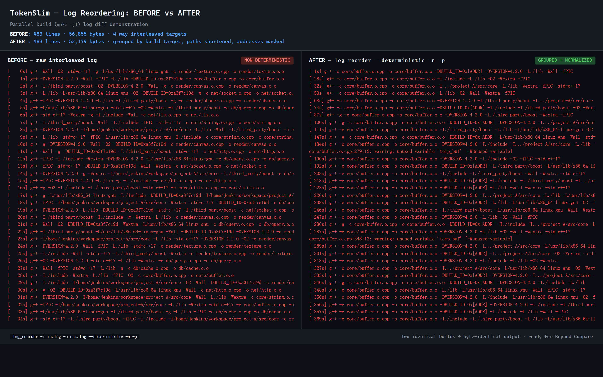

<div dir="rtl" align="right">

<p align="center">
  <h1 align="center">TokenSlim</h1>
  <p align="center">
    محرك ضغط Token عالي الأداء بلغة Rust لمدخلات نماذج LLM.<br>
    معتمد على الإضافات · توفير 50-95% من الـ Tokens · تصدير تشخيصات للذكاء الاصطناعي · CLI / خادم / بيئة تطوير / SDK
  </p>
</p>

<p align="center">
  <a href="https://github.com/nuoyazhizhou/tokenslim/actions/workflows/build-release.yml"></a>
  <a href="https://www.npmjs.com/package/tokenslim"></a>
  <a href="https://pypi.org/project/tokenslim/"></a>
  <a href="https://github.com/nuoyazhizhou/tokenslim/blob/main/LICENSE"></a>
</p>

<p align="center">
  <a href="#ما-هو-tokenslim">ما هو TokenSlim؟</a> ·
  <a href="#لماذا-tokenslim">لماذا؟</a> ·
  <a href="#الميزات">الميزات</a> ·
  <a href="#التثبيت">التثبيت</a> ·
  <a href="#الاستخدام">الاستخدام</a> ·
  <a href="#الإضافات">الإضافات</a> ·
  <a href="#التكاملات">التكاملات</a> ·
  <a href="#الترخيص">الترخيص</a>
</p>

<p align="center">
  <a href="./README.md">English</a> · <a href="./README.zh-CN.md">简体中文</a> · <a href="./README.ja.md">日本語</a> · <a href="./README.ko.md">한국어</a> · <a href="./README.es.md">Español</a> · <a href="./README.fr.md">Français</a> · <a href="./README.de.md">Deutsch</a> · <strong>العربية</strong>
</p>

---

## ما هو TokenSlim؟

TokenSlim هو محرك ضغط نصوص عالي الأداء قائم على الإضافات، مكتوب بـ Rust. مهمته الأساسية هي **خفض تكلفة الرموز لمدخلات نماذج LLM بشكل جذري**، وجعل من الممكن احتواء سجلات طويلة وضوضائية من العالم الحقيقي (خطوط أنابيب البناء، تشغيل CI، سجلات وصول الويب، آثار قواعد البيانات، سجلات السحابة، مخرجات VCS، آثار المكدس، إلخ) في نافذة سياق LLM — دون فقدان الإشارات التشخيصية التي يحتاجها النموذج.

على المدخلات عالية البنية والمتكررة (سجلات المترجم، مخرجات البناء، سجلات CI، سجلات الوصول، إلخ)، يقدم TokenSlim عادةً تقليلاً بنسبة **50%–90%** مع الحفاظ على 100% من المعلومات الأصلية. في وضع **AI Export** المصمم خصيصًا لاستهلاك LLM، يصل التخفيض إلى **90%–95%** مع إزالة ضوضاء مدركة للسياق تحتفظ بنافذة الخطأ/التحذير التي يحتاجها النموذج للاستدلال.

إلى جانب الضغط، يأتي TokenSlim بأدوات تشخيص البيئة (أوامر `workspace` و`encoding` و`rule` و`env`) التي تكتشف تلقائيًا نظام التشغيل والصدفة وصفحة الرموز وإعدادات ترميز Python/Node/JDK، وتضع علامة على خطر Mojibake وتصدر إصلاحات قابلة للتنفيذ. مدمجًا مع سلسلة احتياطية لفك ترميز العمليات الفرعية (UTF-8 أولاً، ثم مرشحات صفحات الرموز)، يبقى موثوقًا في البيئات متعددة اللغات.


## شاهدها أثناء العمل

### الاستخدام اليومي في العالم الحقيقي — `tokenslim gain`

هكذا يبدو `tokenslim gain` بعد أشهر من الاستخدام اليومي لأوامر git:

```
$ tokenslim gain

TokenSlim Cumulative Savings Report
====================================

Usage Statistics:
  Total runs:          7,244
  Input tokens:        13.2M
  Output tokens:       9.4M
  Tokens saved:        3.9M
  Overall compression: 29.3%

Estimated Savings:
  Tokens saved:        3,883,551 tokens
       claude-4.8:     $19.42 USD ($5.00/1M)
       gpt-5.5:        $19.42 USD ($5.00/1M)
       gemini-3.1-pro: $7.77 USD  ($2.00/1M)
```

> 💡 يتتبع `tokenslim gain` **كل عملية ضغط** تقوم بتشغيلها ويعرض التوفير التراكمي. الأرقام أعلاه مأخوذة من سير العمل اليومي لمطور واحد — سوف تتضاعف مدخرات فريقك من هنا.

### يختلف الضغط حسب نوع الإدخال

لا يتم ضغط جميع المدخلات بالتساوي - وهذا متوقع. يتم ضغط السجلات المتكررة والمنظمة للغاية أكثر بكثير من المحتوى الكثيف بالمعلومات مثل فروقات git (git diffs):

<table>
<tr>
<th>نوع الإدخال</th>
<th>التخفيض النموذجي</th>
<th>السبب</th>
</tr>
<tr>
<td>🔨 سجلات البناء (cargo, gcc, gradle)</td>
<td align="center"><strong>70–95%</strong></td>
<td>تكرار هائل: الطوابع الزمنية، خطوط التقدم، المخرجات الروتينية</td>
</tr>
<tr>
<td>🌐 سجلات الوصول للويب (Nginx, Apache)</td>
<td align="center"><strong>80–93%</strong></td>
<td>هيكل متكرر: عناوين IP، المسارات، أكواد الحالة، وكلاء المستخدم (user agents)</td>
</tr>
<tr>
<td>🤖 سجلات CI/CD (GitHub Actions, Jenkins)</td>
<td align="center"><strong>70–92%</strong></td>
<td>خطوات الإعداد، تثبيت التبعيات، مخرجات قياسية (boilerplate)</td>
</tr>
<tr>
<td>☁️ السجلات السحابية (AWS, GCP, Azure)</td>
<td align="center"><strong>60–90%</strong></td>
<td>بيانات JSON منظمة بحقول وصفية متكررة</td>
</tr>
<tr>
<td>🔀 مخرجات VCS (git log, git diff)</td>
<td align="center"><strong>20–40%</strong></td>
<td>كثافة في المعلومات؛ تكرار أقل يمكن إزالته</td>
</tr>
</table>

> النطاق الإجمالي هو **20-95%** اعتمادًا على مدى تكرار وتنظيم إدخالك. استخدم `tokenslim gain` لتتبع مدخراتك الحقيقية بمرور الوقت.

**قبل** — `git status` (22 سطر، ~680 حرفًا):
```
$ git status
On branch master
Changes to be committed:
  (use "git restore --staged <file>..." to unstage)
        modified:   .gitignore
        modified:   src/core/dictionary_engine/test.rs
        modified:   src/plugins/cloud_log_plugin/test.rs

Changes not staged for commit:
  (use "git add <file>..." to update what will be committed)
  (use "git restore <file>..." to discard changes in working directory)
        modified:   Cargo.toml
        modified:   resources/messages.zh-CN.json
        modified:   src/bin/tokenslim-server.rs
        modified:   src/core/plugin_config_loader/mod.rs

Untracked files:
  (use "git add <file>..." to include in what will be committed)
        tests/server_webui_e2e.rs
        webui/
```

**بعد** — `tokenslim git status` (8 أسطر، ~280 حرفًا — نفس المعلومات، بدون فقدان):
```
git status
BR:master
M .gitignore
M src/core/dictionary_engine/test.rs
M src/plugins/cloud_log_plugin/test.rs
M Cargo.toml
M resources/messages.zh-CN.json
M src/bin/tokenslim-server.rs
M src/core/plugin_config_loader/mod.rs
? tests/server_webui_e2e.rs
? webui/
```

> يقوم كل مطور بتشغيل `git status` عشرات المرات يوميًا. يقوم TokenSlim بتجريد التلميحات المتكررة، ويوحد علامات الحالة، ويقدم نفس المعلومات مع **رموز (tokens) أقل بحوالي 60%** — وهذا يتراكم عبر آلاف التفاعلات مع نماذج LLM.
\n## لماذا TokenSlim؟

### 1. توفير حقيقي للأموال
تتأثر تكلفة واجهة LLM بشكل كبير بعدد رموز الإدخال. TokenSlim يخفضها بنسبة 50%–95%:

- **فواتير API أقل** — 50%–95% رموز إدخال أقل.
- **تصدير AI مدرك للسياق (`--ai-export`)** — يزيل السطور الروتينية، ويحتفظ بنافذة الخطأ/التحذير التي يحتاجها النموذج فعليًا؛ يقلل من الهلوسة في المدخلات الضوضائية.
- **سياق فعال أطول** — نفس نافذة السياق، إشارة حقيقية أكثر.
- **Prefill أسرع** — المدخلات الأقصر تعني عادةً prefill أسرع للنموذج وTTFT أقل.

### 2. أداء بدرجة صناعية
- **خط أنابيب بدون نسخ (zero-copy)** — مبني على Rust `Cow<'a, str>`، ومعالجة كتل متوازية باستخدام `rayon`، وتخصيص ساحة `Bump`. يعالج 100 ميجابايت من سجلات بدرجة صناعية في **~250 مللي ثانية**، أي ما يقارب 400 ميجابايت/ثانية من الإنتاجية.
- **إعادة ترتيب عالمية حتمية** — متتبع أهداف بناء متدفق يصلح التداخل غير المرتب الذي تنتجه `make -jN` / `Ninja`. بنائان متوازيان متطابقان ينتجان دائمًا نفس ترتيب مكدس الخطأ.
- **وضع Sidecar** — خادم REST API عالي الإنتاجية، قابل للتضمين في سير عمل IDE / CI / Agent بدون أي تكلفة بدء تشغيل.

### 3. استخراج قائم على البيانات
- **استخراج المسار باستخدام Radix-Trie** — لا يقسم TokenSlim سطرًا بسطر. بعد مسح 100 ميجابايت من المدخلات، يبني radix-trie على مستوى المشروع في الذاكرة ولا يُصدر قواميس الدليل (`$D`) إلا على الفروع الساخنة (الوزن > 10)، مما يقضي على الرموز المجزأة.
- **علامات دلالية** — بدائل مدركة للبيئة لـ Android وiOS وGCC وMSVC والـ linkers.
- **كشف منظومة البناء الكاملة** — C/C++، Rust، Go، Java، Android، iOS/Xcode، MSVC، Swift، والـ linkers الرئيسية، مع طي مدرك للسياق وإزالة تكرار الأخطاء.

## الميزات

- **ثلاثة أوقات تشغيل**
  - **CLI** — معالجة دفعات قابلة للبرمجة
  - **Server** — واجهة REST API طويلة العمر لتكامل المنظومة الكاملة
  - **SDKs** — Java، Python (PyO3)، Node.js
- **منظومة الإضافات** (60+ إضافة تغطي مصادر إدخال LLM الأكثر شيوعًا)
  - **الجوال** — `android_gradle`، `xcode_log`
  - **التطوير العام** — `gcc_log`، `java_stack`، `python_traceback`، `dotnet`، `rust_go`، `maven`، `gradle`، `node_error`، `nodejs`، `php_ruby`، `unity_unreal`
  - **البيانات المهيكلة** — `json`، `yaml`، `xml_html`، `ndjson`، `protobuf`
  - **مخرجات البناء** — `artifact_summary` (SARIF / JUnit XML)، مع الحفاظ الدلالي على حالة الاختبار، SARIF level/rule/location/tool
  - **السحابة والعمليات** — `cloud_log` (AWS / GCP / Azure / Alibaba / OCI / Tencent / Huawei / Cloudflare)، `web_log` (Nginx / Apache / ingress / Envoy / CloudFront / IIS / ALB / Cloudflare)، `db_log` (PostgreSQL / MySQL / MongoDB / Redis)، `syslog`
  - **CI/CD** — `ci_log` (GitHub Actions / GitLab CI / Jenkins / Azure Pipelines / CircleCI / Buildkite / `act` محلي / TeamCity / Travis CI)
  - **VCS** — `vcs_plugin` موحد لـ git / svn / hg / p4 / cvs / bzr / fossil / darcs، بالإضافة إلى `git_diff`، `smart_code` (مستوى AST)، `smart_path`
- **تشخيص البيئة** — الأوامر الفرعية `workspace` و`encoding` و`rule` و`env` تكتشف خطر Mojibake وتصدر وصفات إصلاح.
- **أوضاع إخراج أصلية للذكاء الاصطناعي**
  - `--ai-export` — إزالة ضوضاء مدركة للسياق، تحتفظ بنافذة الخطأ/التحذير
  - `--ai-signal` — مع فقد ولكن بإشارة عالية، تحتفظ بأكثر الحقول صلة باتخاذ القرار
- **تأمل الإضافات** — `tokenslim explain-plugin` و`tokenslim run --explain-route` يشرحان اختيار المسار والاحتياطات والثقة والبدائل، ويعيدان تشغيل التصنيفات الخاطئة للتدقيق.

## التثبيت

### من المصدر (Rust toolchain ≥ 1.75)

```bash
git clone https://github.com/nuoyazhizhou/tokenslim.git
cd tokenslim
cargo build --release
```

يقع الملف التنفيذي في `./target/release/tokenslim` (أو `tokenslim.exe` على Windows).

### الملفات التنفيذية الجاهزة

حمّل من صفحة [Releases](https://github.com/nuoyazhizhou/tokenslim/releases).

### الإعداد (اختياري)

تمر جميع إعدادات وقت التشغيل عبر متغيرات البيئة. انسخ [`.env.example`](./.env.example) إلى `.env` واملأ قيمك المحلية. يتم تجاهل `.env` افتراضيًا في git؛ يتم تتبع قالب المثال فقط.

يحتاج معظم المستخدمين فقط إلى `RUST_LOG=info` (أو `debug` لتتبع مطوّل). متغيرات LLM-Audit (`OPENAI_API_KEY` و`OPENAI_BASE_URL` و`OPENAI_MODEL`) مطلوبة فقط إذا شغّلت `scripts/audit_*.py --llm-audit` — بدونها، تتدهور التدقيقات إلى وضع lint فقط.

### تكاملات المحرر / IDE

- **VS Code** — انظر `vscode-extension/`
- **Chrome** — انظر `chrome-extension/`
- **JetBrains** — انظر `jetbrains-plugin/`

### SDKs

- **Node.js / TypeScript** — `npm i tokenslim` (المصدر: [`packages/sdk-nodejs/`](./packages/sdk-nodejs/))
- **Python** — انظر [`sdk/python/tokenslim_sdk.py`](./sdk/python/tokenslim_sdk.py) (عميل ملف واحد)
- **Java 11+** — انظر [`sdk/java/TokenSlimClient.java`](./sdk/java/TokenSlimClient.java)

> 📖 [دليل البدء السريع في 5 دقائق](./docs/guides/QUICKSTART.md) · [دليل استخدام SDK الكامل](./docs/guides/SDK_USAGE.md) · [دليل المستخدم](./docs/guides/USER_GUIDE.md)

## الاستخدام

### CLI

```bash
# ضغط سجل بناء
tokenslim -i build.log -o output.json --reorder

# تقرير تشخيصي منزوع الضوضاء ملائم للذكاء الاصطناعي
tokenslim decompress -i output.json -o ai_report.txt --ai-export

# وضع فقد بإشارة عالية (يحتفظ بنافذة الخطأ + البيانات الوصفية الرئيسية)
tokenslim decompress -i output.json -o ai_signal.txt --ai-signal

# التحقق من قاعدة ثابتة (ملف واحد)
tokenslim --verify-rule tests/fixtures/static_rule/sample_rule.toml \
  --verify-fixture tests/fixtures/static_rule/sample_fixture.log \
  --verify-expected tests/fixtures/static_rule/sample_expected.txt

# التحقق من قاعدة ثابتة (دفعة، وضع دليل)
tokenslim --verify-rule tests/fixtures/static_rule/sample_rule.toml \
  --verify-fixture tests/fixtures/static_rule \
  --verify-expected tests/fixtures/static_rule

# تمهيد المشروع وخطافات الصدفة
tokenslim init
tokenslim workspace
tokenslim --dry-run workspace --inject
tokenslim workspace --inject
tokenslim hooks install
tokenslim hooks status
tokenslim hooks uninstall
```

### Server (Sidecar)

```bash
tokenslim-server
# يستمع على 127.0.0.1:<port>، يعرض /health و/compress و/decompress
```


#### واجهة المستخدم (Web UI)

يأتي الـ sidecar مزودًا بواجهة مستخدم مدمجة من صفحة واحدة للضغط التفاعلي ومتابعة السجلات الحية. تم **تجميع جميع الأصول الثابتة للواجهة الأمامية مباشرة في الملف التنفيذي الثنائي**. سواء تم تثبيته عبر npm أو pip، فإنه يعمل فورًا من أي دليل بدون أي إعدادات إضافية.


##### التشغيل

```bash
# التشغيل من أي دليل (يخدم واجهة المستخدم المدمجة تلقائيًا)
tokenslim-server

# وضع تطوير الواجهة الأمامية (يخدم من دليل فعلي للتحديث المباشر)
TOKENSLIM_WEBUI_DIR=./webui tokenslim-server

# اختيار المنفذ وعنوان الربط
TOKENSLIM_PORT=10086 TOKENSLIM_HOST=127.0.0.1 tokenslim-server

# تعطيل المصادقة أثناء الاختبار المحلي (الافتراضي: معطل إذا لم يتم تعيين متغير البيئة)
# TOKENSLIM_API_KEY=changeme tokenslim-server
```

### SDK

```python
# Python
from tokenslim import compress, decompress
compressed = compress(open("build.log").read())
print(decompress(compressed, mode="ai-export"))
```

```javascript
// Node.js
const { compress, decompress } = require("tokenslim");
const compressed = compress(fs.readFileSync("build.log", "utf8"));
console.log(decompress(compressed, { mode: "ai-export" }));
```

```java
// Java
TokenSlimClient client = new TokenSlimClient("http://127.0.0.1:8080");
String compressed = client.compress(logText);
String report = client.decompress(compressed, "ai-export");
```

## إعادة ترتيب السجلات (Log Reordering)



أدوات البناء المتوازي (`make -jN` و`ninja` وBazel وMSBuild …) تُشابك سجلات عدة أهداف بترتيب **غير حتمي** يُفسد كل مقارنات الـdiff والـcache والـregression. يأتي TokenSlim مزودًا بـ**مُعيد ترتيب عام حتمي** يعالج السجل بشكل تيارّي، ويتتبع هدف البناء النشط، ويُخرج الأسطر بترتيب ثابت مجمّع حسب الهدف.

```bash
# مدمج: علم ‎--reorder‎ يُجبر مُعيد الترتيب ويُسقط إلى الوضع التتابعي
tokenslim -i build.log -o output.json --reorder

# أداة مستقلة: diff log→log صرف (لبيئات Jenkins / CI) بدون المسار الكامل
cargo build --release --bin log_reorder
./target/release/log_reorder -i messy_build.log -o sorted_build.log --deterministic -n -p
#   --deterministic  : تجميع الأسطر حسب الوحدة / هدف البناء
#   -n  (--normalize) : ترتيب الأعلام غير المرتبة، وإخفاء العناوين وقيم الـhash العشوائية
#   -p  (--shorten-paths) : اختصار /home/userA/workspace/... إلى آخر 3 مقاطع
```

نفس المحرك متاح عبر `POST /compress` (حقل `reorder: true`)، ومربع الاختيار «تمكين إعادة الترتيب» في WebUI، وحزم SDK لـPython وNode.

## الإضافات

يأتي TokenSlim مع **60+ إضافة** تغطي المدخلات التي تهيمن على حركة LLM الحقيقية. كل إضافة قائمة على البيانات (تكوين JSON / TOML تحت `config/plugins/`) والتوجيه قائم على المسار، لذا فإن إضافة تنسيق مصدر جديد هي في معظم الحالات مجرد تغيير في التكوين.

تصفح السجل الكامل في [`config/plugins/`](./config/plugins/)، أو شغّل:

```bash
tokenslim plugins list
tokenslim explain-plugin --explain-command "cargo build"
```

## التكاملات

| السطح | المسار | الحالة |
|---|---|---|
| CLI | `src/bin/tokenslim-server.rs`, `src/cli/` | Stable |
| REST Server | `src/bin/tokenslim-server.rs` | Stable |
| VS Code | `vscode-extension/` | Stable |
| Chrome | `chrome-extension/` | Stable |
| JetBrains | `jetbrains-plugin/` | Stable |
| Python SDK | `crates/tokenslim-py/` | Stable |
| Node.js SDK | `packages/sdk-nodejs/` (npm: `tokenslim@0.1.0`) | Stable |
| Java SDK | `sdk/java/` | Stable |

## البنية المعمارية

يتبع TokenSlim خط أنابيب متعدد الطبقات:

1. **موجّه المسار (Route dispatcher)** — يختار الإضافة/الإضافات حسب توقيع الأمر / المحتوى.
2. **سلسلة الإضافات** — كل إضافة تمتلك الاستخراج والطي والاستبدال الدلالي.
3. **نواة الضغط** — استخراج المسار بـ radix-trie، طبقات القاموس، إزالة التكرار العالمية.
4. **إعادة الترطيب (Rehydration)** — آمن round-trip، يمكن استرداد المدخل الأصلي بالكامل من الشكل المضغوط.
5. **AI Export / Signal** — معالجة لاحقة مدركة للسياق لاستهلاك LLM.

راجع `docs/development/ARCHITECTURE.md` للتصميم الكامل.

## 🛡️ حوكمة وكيل الذكاء الاصطناعي وصندوق الحماية ضد الانحراف (AI Agent Governance & Anti-Drift Sandbox)

إن أصعب مشكلة في التوليد التلقائي للكود بواسطة الذكاء الاصطناعي هي **"منع وكيل الترميز (Coding Agent) من كتابة الكود وكتابة اختبارات وهمية مهنئة لنفسه (مدخلات فاسدة تؤدي لمخرجات فاسدة)"**، و**"منع عمليات إعادة الهيكلة اللاحقة (Refactoring) من إدخال انحراف صامت عن الهدف (تراجع في السلوك)."**

في بيئة برمجية معقدة تحتوي على أكثر من **105 ألف سطر من الكود المصدري الأساسي (LOC)، و60+ مكون إضافي (Plugins)، و1000+ حالة اختبار مادية**، يظل TokenSlim قويًا ليس من خلال التصحيح اليدوي، ولكن من خلال **صندوق حماية الجودة (Quality Sandbox)** المؤتمت والمغلق الحلقات الذي يضبط سلوك توليد الكود بالذكاء الاصطناعي:

1. **استخراج النية وحقن توثيق الكود ([`extract_plugin_design.py`](scripts/extract_plugin_design.py))**: يمسح الكود المصدري للمحلل (Parser)، ويستغل النماذج اللغوية الكبيرة (LLMs) لاستخراج عقود التصميم الأساسية (`design_intent`/`keep_signals`)، ثم **يحقنها تلقائيًا مرة أخرى في `mod.rs` كتعليقات توثيقية `//!` على مستوى الوحدة**! هذا يجبر المبرمجين المستقبليين (سواء كانوا ذكاءً اصطناعيًا أو بشرًا) على احترام حدود التصميم التي تمثل مصدر الحقيقة الوحيد.
2. **مزامنة الترجمة التلقائية متعددة اللغات ([`translate_messages_fields.py`](scripts/translate_messages_fields.py))**: يتحقق مرتين من ملفات الترجمة للغتين الصينية والإنجليزية، ويقوم تلقائيًا بمحاذاة الإدخالات المفقودة عبر ترجمة LLM لتجنب سقوط أي مفاتيح.
3. **تدقيق جودة الحالات المادية ([`audit_sample_case_quality.py`](scripts/audit_sample_case_quality.py))**: القاضي الجزئي (Micro-Judge). يتحقق من واقعية ومحاذاة حالات السجلات المادية الخام مع عقد التصميم المستخرج، مصفياً الحالات المزيفة/المصنعة بواسطة الذكاء الاصطناعي. يقوم بمسح مجلدات العينات و**يخرج تلقائيًا أسطر برمجية لإلحاقها بملف `showcase.rs`** إذا لم تكن السجلات المادية الجديدة مسجلة.
4. **تدقيق دقة الضغط ([`audit_case_metrics.py`](scripts/audit_case_metrics.py))**: القاضي المتوسط (Meso-Judge). يفرض محاذاة **تسجيل `showcase.rs`**، و**الملفات المادية في `samples/`**، و**التقارير التي تم إنشاؤها في `target/`**. يتحقق من بوابات الحسم G1-G4 (لضمان عدم فقدان الأخطاء الحرجة ومراسخ الأوامر أبداً) ويستخدم النماذج اللغوية الكبيرة للمطابقة المتبادلة بين الضغط وعقد التصميم.
5. **تجميد الحالة ومنع التراجع (State Freeze)**: بمجرد التدقيق، يتم قفل المخرجات باستخدام تشفير SHA256. إذا أدت تغييرات الذكاء الاصطناعي المستقبلية إلى كسر المخرجات المتوقعة، فإن خط أنابيب CI/CD **يرفض فوراً ويمنع الإصدار**، مما يحول دون حدوث انحراف صامت.
6. **حوكمة الصحة العالمية ([`audit_all_case_metrics.py`](scripts/audit_all_case_metrics.py))**: القاضي الكلي (Macro-Judge). ينسق عمليات التدقيق المتوازية عبر جميع المكونات الإضافية الـ 60+ في CI/CD، مجمعًا مصفوفة صحة عالمية (`audit_health.md`) لوضع اللمسات الأخيرة على حظر الجودة وتأمينها.

## المساهمة

نرحب بالمساهمات. يرجى فتح issue أولاً لمناقشة التغييرات الكبيرة؛ يمكن إرسال التصحيحات الصغيرة وإعدادات الإضافات الجديدة مباشرة كـ PR.

```bash
# تشغيل الاختبارات
cargo test

# التشغيل مع عينة
tokenslim -i samples/web_log_plugin/case_001_access.log -o out.json --reorder
```

## الترخيص

[MIT](./LICENSE)

</div>
