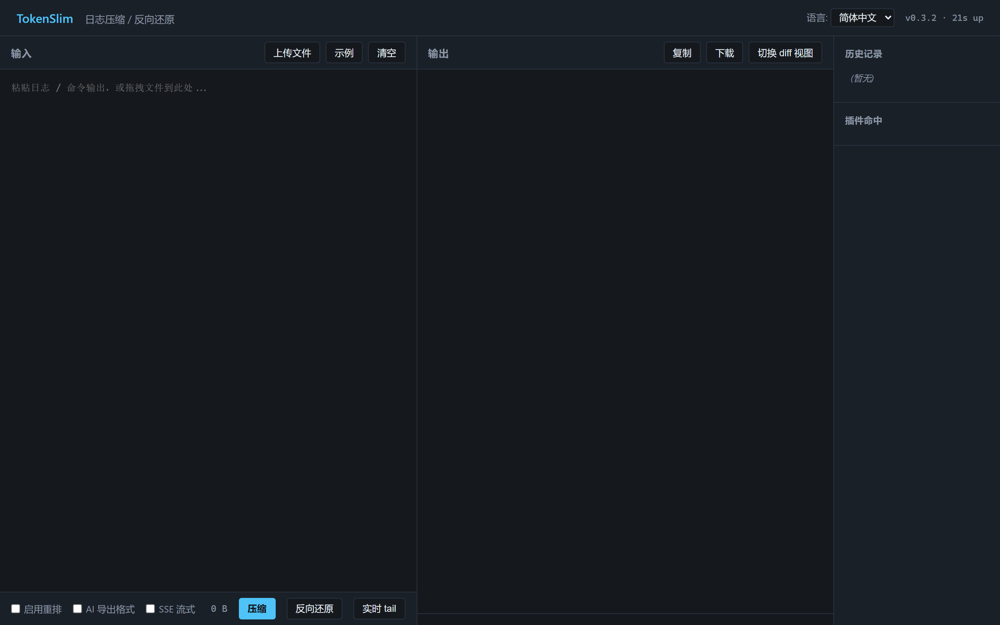

<p align="center">
  <h1 align="center">TokenSlim</h1>
  <p align="center">
    LLM 入力向けの高性能 Rust トークン圧縮エンジン。<br>
    プラグイン式 · 50%–95% トークン削減 · AI エクスポート診断 · CLI / Server / IDE / SDK
  </p>
</p>

<p align="center">
  <a href="https://github.com/nuoyazhizhou/tokenslim/actions/workflows/build-release.yml"></a>
  <a href="https://www.npmjs.com/package/tokenslim"></a>
  <a href="https://pypi.org/project/tokenslim/"></a>
  <a href="https://github.com/nuoyazhizhou/tokenslim/blob/main/LICENSE"></a>
</p>

<p align="center">
  <a href="#token-とは">TokenSlim とは</a> ·
  <a href="#なぜ-tokenslim">なぜ TokenSlim</a> ·
  <a href="#主な機能">主な機能</a> ·
  <a href="#インストール">インストール</a> ·
  <a href="#使い方">使い方</a> ·
  <a href="#プラグイン">プラグイン</a> ·
  <a href="#統合">統合</a> ·
  <a href="#ライセンス">ライセンス</a>
</p>

<p align="center">
  <a href="./README.md">English</a> · <a href="./README.zh-CN.md">简体中文</a> · <strong>日本語</strong> · <a href="./README.ko.md">한국어</a> · <a href="./README.es.md">Español</a> · <a href="./README.fr.md">Français</a> · <a href="./README.de.md">Deutsch</a> · <a href="./README.ar.md">العربية</a>
</p>

---

## TokenSlim とは？

TokenSlim は、Rust で書かれた高性能・プラグイン式のテキスト圧縮エンジンです。その中核的な使命は、**LLM 入力のトークンコストを劇的に削減する**こと、そして長くノイズの多い実世界のログ（ビルドパイプライン、CI 実行、Web アクセスログ、データベーストレース、クラウドログ、VCS 出力、スタックトレースなど）を、モデルが必要とする診断信号を失うことなく LLM のコンテキストウィンドウに収めることを可能にすることです。

コンパイラログ、ビルド出力、CI ログ、アクセスログなど、高度に構造化され反復の多い入力に対して、TokenSlim は元情報の 100% を保持しながら通常 **50%–90%** の削減を実現します。LLM 消費専用に設計された **AI Export** モードでは、削減率は **90%–95%** に達し、モデルが推論に必要なエラー/警告コンテキストを保持する文脈認識型ノイズ除去を行います。

圧縮以外にも、TokenSlim には環境診断ツール（`workspace`、`encoding`、`rule`、`env` コマンド）が付属しており、OS、シェル、コードページ、Python/Node/JDK のエンコーディング設定を自動検出し、文字化けリスクをフラグ付けして実用的な修正を出力します。サブプロセスのデコードフォールバックチェーン（最初に UTF-8、次にコードページの候補）と組み合わせることで、多言語混在環境でも信頼性を維持します。


## 動作を見る

### 実際の日常使用 — `tokenslim gain`

これは、gitコマンドで数ヶ月間毎日使用した後の `tokenslim gain` の様子です：

```
$ tokenslim gain

TokenSlim Cumulative Savings Report
====================================

Usage Statistics:
  Total runs:          7,244
  Input tokens:        13.2M
  Output tokens:       9.4M
  Tokens saved:        3.9M
  Overall compression: 29.3%

Estimated Savings:
  Tokens saved:        3,883,551 tokens
       claude-4.8:     $19.42 USD ($5.00/1M)
       gpt-5.5:        $19.42 USD ($5.00/1M)
       gemini-3.1-pro: $7.77 USD  ($2.00/1M)
```

> 💡 `tokenslim gain` は実行する**すべての圧縮**を追跡し、累積の節約量を表示します。上の数字は一人の開発者の日常ワークフローからのものです — チームの節約量はここからさらに乗算されます。

### 圧縮率は入力タイプによって異なります

すべての入力が同じように圧縮されるわけではありません — そしてそれは予想通りです。繰り返しが多く構造化されたログは、git diffのような情報密度の高いコンテンツよりもはるかに多く圧縮されます：

<table>
<tr>
<th>入力タイプ</th>
<th>一般的な削減率</th>
<th>理由</th>
</tr>
<tr>
<td>🔨 ビルドログ (cargo, gcc, gradle)</td>
<td align="center"><strong>70–95%</strong></td>
<td>大量の繰り返し: タイムスタンプ、進行状況の行、定型出力</td>
</tr>
<tr>
<td>🌐 Webアクセスログ (Nginx, Apache)</td>
<td align="center"><strong>80–93%</strong></td>
<td>反復的な構造: IP、パス、ステータスコード、ユーザーエージェント</td>
</tr>
<tr>
<td>🤖 CI/CDログ (GitHub Actions, Jenkins)</td>
<td align="center"><strong>70–92%</strong></td>
<td>セットアップステップ、依存関係のインストール、ボイラープレート出力</td>
</tr>
<tr>
<td>☁️ クラウドログ (AWS, GCP, Azure)</td>
<td align="center"><strong>60–90%</strong></td>
<td>反復的なフィールドとメタデータを持つ構造化JSON</td>
</tr>
<tr>
<td>🔀 VCS出力 (git log, git diff)</td>
<td align="center"><strong>20–40%</strong></td>
<td>情報密度が高い; 削除する冗長性が少ない</td>
</tr>
</table>

> 全体的な範囲は、入力の反復性と構造化の度合いに応じて**20〜95%**です。`tokenslim gain` を使用して、時間の経過に伴う実際の節約量を追跡してください。

**圧縮前** — `git status` (22行, 約680文字):
```
$ git status
On branch master
Changes to be committed:
  (use "git restore --staged <file>..." to unstage)
        modified:   .gitignore
        modified:   src/core/dictionary_engine/test.rs
        modified:   src/plugins/cloud_log_plugin/test.rs

Changes not staged for commit:
  (use "git add <file>..." to update what will be committed)
  (use "git restore <file>..." to discard changes in working directory)
        modified:   Cargo.toml
        modified:   resources/messages.zh-CN.json
        modified:   src/bin/tokenslim-server.rs
        modified:   src/core/plugin_config_loader/mod.rs

Untracked files:
  (use "git add <file>..." to include in what will be committed)
        tests/server_webui_e2e.rs
        webui/
```

**圧縮後** — `tokenslim git status` (8行, 約280文字 — 同じ情報、損失ゼロ):
```
git status
BR:master
M .gitignore
M src/core/dictionary_engine/test.rs
M src/plugins/cloud_log_plugin/test.rs
M Cargo.toml
M resources/messages.zh-CN.json
M src/bin/tokenslim-server.rs
M src/core/plugin_config_loader/mod.rs
? tests/server_webui_e2e.rs
? webui/
```

> すべての開発者は1日に何十回も `git status` を実行します。TokenSlim は定型的なヒントを取り除き、ステータスマーカーを統一し、同じ情報を**約60%少ないトークン**で提供します — そしてこれは何千回もの LLM との対話で積み重なっていきます。
\n## なぜ TokenSlim？

### 1. 本当のコスト削減
LLM の API コストは入力トークン数に支配されます。TokenSlim はそれを 50%–95% 削減します：

- **API 料金の削減** — 入力トークンを 50%–95% 削減。
- **文脈認識 AI Export (`--ai-export`)** — 定型行を取り除き、モデルが実際に必要とするエラー/警告ウィンドウを保持。ノイズの多い入力での幻覚（ハルシネーション）を低減。
- **より長い実効コンテキスト** — 同じコンテキストウィンドウでより多くの実信号。
- **プリフィルの高速化** — 入力が短いほどモデルのプリフィルは高速になり TTFT が低下。

### 2. 産業グレードのパフォーマンス
- **ゼロコピーパイプライン** — Rust `Cow<'a, str>`、`rayon` による並列ブロック処理、`Bump` アリーナ割り当ての上に構築。産業グレードのログ 100 MB を **約 250 ms**、約 400 MB/秒のスループットで処理。
- **決定論的なグローバルリオーダー** — ストリーミングビルド対象トラッカーが `make -jN` / `Ninja` が生成する順序のずれたインターリーブを修正。同じ並列ビルド 2 回が常に同じエラースタック順を生成。
- **サイドカーモード** — 高スループット REST API サーバー、IDE / CI / Agent ワークフローにゼロ起動オーバーヘッドで組み込み可能。

### 3. データ駆動の抽出
- **基数トライによるパス抽出** — TokenSlim は行ごとにスライスしません。100 MB の入力をスキャンした後、プロジェクト全体の基数トライをメモリに構築し、ホットブランチ（重み > 10）でのみディレクトリ辞書（`$D`）を出力し、断片的なトークンを排除。
- **セマンティックマーカー** — Android、iOS、GCC、MSVC、リンカー向けの環境認識置換。
- **フルビルドエコシステムの検出** — C/C++、Rust、Go、Java、Android、iOS/Xcode、MSVC、Swift、主要リンカー、文脈認識折りたたみとエラー重複除去付き。

## 主な機能

- **3 つのランタイム**
  - **CLI** — スクリプト可能なバッチ処理
  - **Server** — エコシステム統合のための長寿命 REST API
  - **SDK** — Java、Python（PyO3）、Node.js
- **プラグインエコシステム**（LLM 入力源の最も一般的なものをカバーする 60+ プラグイン）
  - **モバイル** — `android_gradle`、`xcode_log`
  - **一般開発** — `gcc_log`、`java_stack`、`python_traceback`、`dotnet`、`rust_go`、`maven`、`gradle`、`node_error`、`nodejs`、`php_ruby`、`unity_unreal`
  - **構造化データ** — `json`、`yaml`、`xml_html`、`ndjson`、`protobuf`
  - **ビルド成果物** — `artifact_summary`（SARIF / JUnit XML）、テストステータス、SARIF level/rule/location/tool の意味的保持
  - **クラウド・運用** — `cloud_log`（AWS / GCP / Azure / Alibaba / OCI / Tencent / Huawei / Cloudflare）、`web_log`（Nginx / Apache / ingress / Envoy / CloudFront / IIS / ALB / Cloudflare）、`db_log`（PostgreSQL / MySQL / MongoDB / Redis）、`syslog`
  - **CI/CD** — `ci_log`（GitHub Actions / GitLab CI / Jenkins / Azure Pipelines / CircleCI / Buildkite / ローカル `act` / TeamCity / Travis CI）
  - **VCS** — git / svn / hg / p4 / cvs / bzr / fossil / darcs 用の統一 `vcs_plugin`、さらに `git_diff`、`smart_code`（AST レベル）、`smart_path`
- **環境診断** — `workspace`、`encoding`、`rule`、`env` サブコマンドが文字化けリスクを検出し、修正レシピを出力。
- **AI ネイティブ出力モード**
  - `--ai-export` — 文脈認識ノイズ除去、エラー/警告ウィンドウを保持
  - `--ai-signal` — 損失ありだが高信号、意思決定に最も関連するフィールドを保持
- **プラグイン内省** — `tokenslim explain-plugin` と `tokenslim run --explain-route` がルート選択、フォールバック、信頼度、代替案を説明し、誤分類を再生して監査可能。

## インストール

### ソースからビルド（Rust toolchain ≥ 1.75）

```bash
git clone https://github.com/nuoyazhizhou/tokenslim.git
cd tokenslim
cargo build --release
```

バイナリは `./target/release/tokenslim`（Windows では `tokenslim.exe`）に配置されます。

### プレビルドバイナリ

[Releases](https://github.com/nuoyazhizhou/tokenslim/releases) ページからダウンロード。

### 設定（オプション）

すべてのランタイム設定は環境変数経由で行います。[`.env.example`](./.env.example) を `.env` にコピーし、ローカル値を入力してください。`.env` はデフォルトで git 無視されます。追跡されるのはサンプルテンプレートのみです。

ほとんどのユーザは `RUST_LOG=info`（詳細トレースには `debug`）のみが必要です。LLM 監査関連の変数（`OPENAI_API_KEY`、`OPENAI_BASE_URL`、`OPENAI_MODEL`）は `scripts/audit_*.py --llm-audit` を実行する場合にのみ必要です。これらがなくても、監査は lint のみモードにフォールバックします。

### エディタ / IDE 統合

- **VS Code** — `vscode-extension/` を参照
- **Chrome** — `chrome-extension/` を参照
- **JetBrains** — `jetbrains-plugin/` を参照


#### Web UI

サイドカーには、インタラクティブな圧縮とライブログの tail が可能なシングルページ UI が組み込まれています。すべてのフロントエンド静的アセットは**バイナリ実行ファイルに直接コンパイルされています**。npm や pip 経由でインストールした場合でも、どのディレクトリからでもゼロ設定でそのまま動作します。



##### 起動

```bash
# 任意のディレクトリから実行（内嵌 Web UI を自動的に提供）
tokenslim-server

# フロントエンド開発モード（ホットリロード用に物理ディレクトリから提供）
TOKENSLIM_WEBUI_DIR=./webui tokenslim-server

# ポートとバインド・アドレスを指定
TOKENSLIM_PORT=10086 TOKENSLIM_HOST=127.0.0.1 tokenslim-server

# ローカルでのテスト時に認証を無効化（デフォルト: 環境変数が未設定の場合はオフ）
# TOKENSLIM_API_KEY=changeme tokenslim-server
```

### SDK

- **Node.js / TypeScript** — `npm i tokenslim`（ソース：[`packages/sdk-nodejs/`](./packages/sdk-nodejs/)）
- **Python** — [`sdk/python/tokenslim_sdk.py`](./sdk/python/tokenslim_sdk.py)（単一ファイルクライアント）
- **Java 11+** — [`sdk/java/TokenSlimClient.java`](./sdk/java/TokenSlimClient.java)

> 📖 [5 分で始める Quickstart](./docs/guides/QUICKSTART.md) · [SDK 使用ガイド](./docs/guides/SDK_USAGE.md) · [ユーザガイド](./docs/guides/USER_GUIDE.md)

## 使い方

### CLI

```bash
# ビルドログを圧縮
tokenslim -i build.log -o output.json --reorder

# AI 向けノイズ除去診断レポート
tokenslim decompress -i output.json -o ai_report.txt --ai-export

# 高信号ロッシーモード（エラーウィンドウ + キーメタデータを保持）
tokenslim decompress -i output.json -o ai_signal.txt --ai-signal

# 静的ルール検証（単一ファイル）
tokenslim --verify-rule tests/fixtures/static_rule/sample_rule.toml \
  --verify-fixture tests/fixtures/static_rule/sample_fixture.log \
  --verify-expected tests/fixtures/static_rule/sample_expected.txt

# 静的ルール検証（バッチ、ディレクトリモード）
tokenslim --verify-rule tests/fixtures/static_rule/sample_rule.toml \
  --verify-fixture tests/fixtures/static_rule \
  --verify-expected tests/fixtures/static_rule

# プロジェクトブートストラップとシェルフック
tokenslim init
tokenslim workspace
tokenslim --dry-run workspace --inject
tokenslim workspace --inject
tokenslim hooks install
tokenslim hooks status
tokenslim hooks uninstall
```

### Server（サイドカー）

```bash
tokenslim-server
# 127.0.0.1:<port> でリッスン、/health、/compress、/decompress を提供
```


#### Web UI

サイドカーには、インタラクティブな圧縮とライブログの tail が可能なシングルページ UI が組み込まれています。すべてのフロントエンド静的アセットは**バイナリ実行ファイルに直接コンパイルされています**。npm や pip 経由でインストールした場合でも、どのディレクトリからでもゼロ設定でそのまま動作します。


##### 起動

```bash
# 任意のディレクトリから実行（内嵌 Web UI を自動的に提供）
tokenslim-server

# フロントエンド開発モード（ホットリロード用に物理ディレクトリから提供）
TOKENSLIM_WEBUI_DIR=./webui tokenslim-server

# ポートとバインド・アドレスを指定
TOKENSLIM_PORT=10086 TOKENSLIM_HOST=127.0.0.1 tokenslim-server

# ローカルでのテスト時に認証を無効化（デフォルト: 環境変数が未設定の場合はオフ）
# TOKENSLIM_API_KEY=changeme tokenslim-server
```

### SDK

```python
# Python
from tokenslim import compress, decompress
compressed = compress(open("build.log").read())
print(decompress(compressed, mode="ai-export"))
```

```javascript
// Node.js
const { compress, decompress } = require("tokenslim");
const compressed = compress(fs.readFileSync("build.log", "utf8"));
console.log(decompress(compressed, { mode: "ai-export" }));
```

```java
// Java
TokenSlimClient client = new TokenSlimClient("http://127.0.0.1:8080");
String compressed = client.compress(logText);
String report = client.decompress(compressed, "ai-export");
```

## プラグイン

TokenSlim には **60+ プラグイン** が付属し、実 LLM トラフィックを支配する入力をカバーします。各プラグインはデータ駆動（`config/plugins/` 下の JSON / TOML 設定）で、ディスパッチはルートベースのため、新しいソースフォーマットの追加はほとんどの場合設定変更だけで済みます。

完全なレジストリは [`config/plugins/`](./config/plugins/) を参照するか、次を実行してください：

```bash
tokenslim plugins list
tokenslim explain-plugin --explain-command "cargo build"
```

## 統合

| サーフェス | パス | ステータス |
|---|---|---|
| CLI | `src/bin/tokenslim-server.rs`, `src/cli/` | Stable |
| REST Server | `src/bin/tokenslim-server.rs` | Stable |
| VS Code | `vscode-extension/` | Stable |
| Chrome | `chrome-extension/` | Stable |
| JetBrains | `jetbrains-plugin/` | Stable |
| Python SDK | `crates/tokenslim-py/` | Stable |
| Node.js SDK | `packages/sdk-nodejs/` (npm: `tokenslim@0.1.0`) | Stable |
| Java SDK | `sdk/java/` | Stable |

## アーキテクチャ

TokenSlim は階層化パイプラインに従います：

1. **ルートディスパッチャ** — コマンド / コンテンツシグネチャでプラグインを選択。
2. **プラグインチェーン** — 各プラグインが抽出、折りたたみ、意味的置換を所有。
3. **圧縮コア** — 基数トライパス抽出、辞書レイヤー化、グローバル重複排除。
4. **再水和** — ラウンドトリップセーフで、圧縮形式から元の入力を完全に復元可能。
5. **AI Export / Signal** — LLM 消費のための文脈認識後処理。

完全な設計は `docs/development/ARCHITECTURE.md` を参照。

## 品質ゲートと監査パイプライン

TokenSlimは、厳密な4ステップのデータ駆動型監査パイプラインを通じて、セマンティックな損失をゼロにし、高い信頼性を維持しています。すべてのパーサーやルールの変更は、以下の自動化された品質ゲートを通過する必要があります：

1. **サンプル品質ゲート (`audit_sample_case_quality.py`)**: テストを開始する前に、生の入力ケース（例: CIログ、スタックトレース）が現実的で、正しくラベル付けされ、高い診断価値を持っていることを検証します。
2. **セマンティック忠実度とメトリクスゲート (`audit_case_metrics.py`)**: 元の入力と圧縮された出力を比較します。Anchor GuardやAnti-Amnesiaのような厳格なポリシーを実施し、重要なエラーコンテキストを失うことなく圧縮率を向上させます。合格したケースは暗号学的に「フリーズ」されます。
3. **グローバルヘルスチェック (`audit_all_case_metrics.py`)**: 60以上のプラグインすべてにわたって同時に実行され、最終的なCIゲートとして機能します。単一のプラグインでも圧縮の後退（Regression）を引き起こしたり、セマンティックな忠実度に違反したりした場合、ビルドは失敗します。
4. **機能マトリクス同期 (`generate_plugin_capability_index.py`)**: フリーズされたケースに基づいてグローバルプラグインルーティングインデックスを自動的に再構築し、動的ルーターが実際のテスト済み機能と常に完全に同期していることを保証します。

## コントリビュート

コントリビューションを歓迎します。大きな変更はまず Issue で議論してください。小さな修正と新しいプラグイン設定は直接 PR で問題ありません。

```bash
# テスト実行
cargo test

# サンプルで実行
tokenslim -i samples/web_log_plugin/case_001_access.log -o out.json --reorder
```

## ライセンス

[MIT](./LICENSE)
