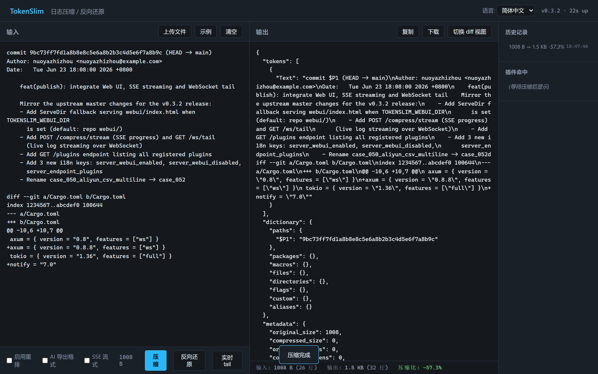
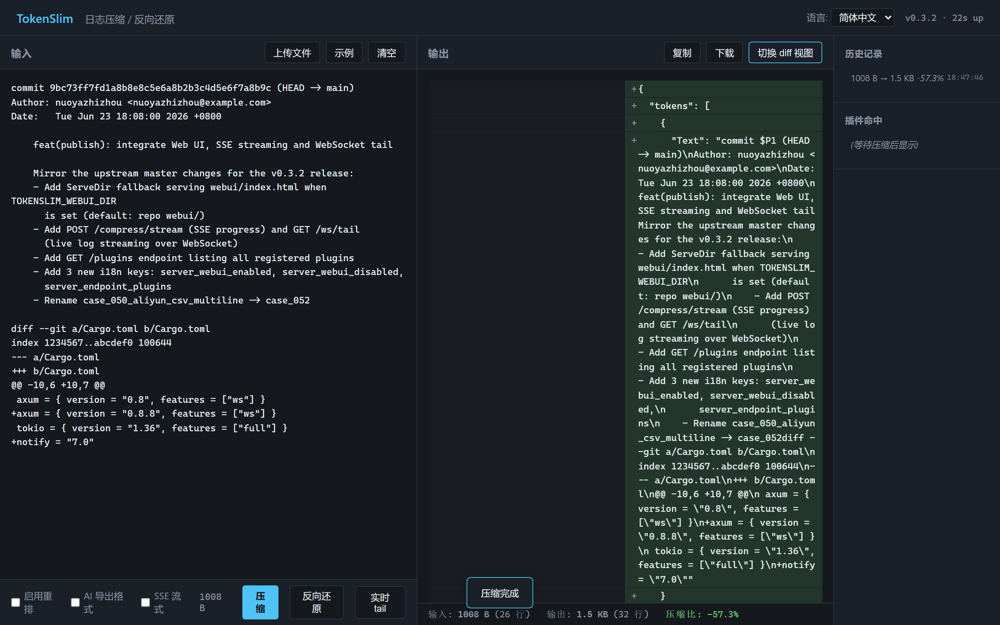
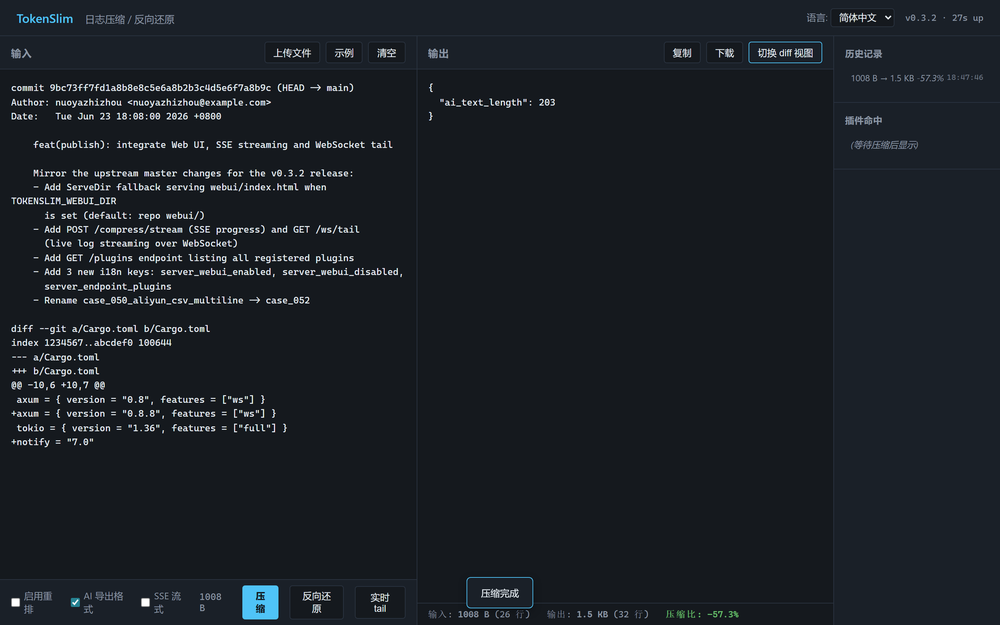

<p align="center">
  <h1 align="center">TokenSlim</h1>
  <p align="center">
    High-performance Rust token compression engine for LLM inputs.<br>
    Plugin-based · 50–95% token savings · AI-export diagnostics · CLI / Server / IDE / SDK
  </p>
</p>

<p align="center">
  <a href="https://github.com/nuoyazhizhou/tokenslim/actions/workflows/build-release.yml"></a>
  <a href="https://www.npmjs.com/package/tokenslim"></a>
  <a href="https://pypi.org/project/tokenslim/"></a>
  <a href="https://github.com/nuoyazhizhou/tokenslim/blob/main/LICENSE"></a>
</p>

<p align="center">
  <a href="#what-is-tokenslim">What is TokenSlim</a> ·
  <a href="#why-tokenslim">Why</a> ·
  <a href="#features">Features</a> ·
  <a href="#installation">Installation</a> ·
  <a href="#usage">Usage</a> ·
  <a href="#plugins">Plugins</a> ·
  <a href="#integrations">Integrations</a> ·
  <a href="#license">License</a>
</p>

<p align="center">
  <strong>English</strong> · <a href="./README.zh-CN.md">简体中文</a> · <a href="./README.ja.md">日本語</a> · <a href="./README.ko.md">한국어</a> · <a href="./README.es.md">Español</a> · <a href="./README.fr.md">Français</a> · <a href="./README.de.md">Deutsch</a> · <a href="./README.ar.md">العربية</a>
</p>

---

## What is TokenSlim?

TokenSlim is a high-performance, plugin-based text compression engine written in Rust. Its core mission is to **dramatically reduce the token cost of LLM inputs** and to make it possible to fit long, noisy real-world logs (build pipelines, CI runs, web access logs, database traces, cloud logs, VCS output, stack traces, etc.) into LLM context windows — without losing the diagnostic signals the model needs.

On highly structured, repetitive inputs (compiler logs, build output, CI logs, access logs, etc.), TokenSlim typically delivers **50%–90%** reduction while preserving 100% of the original information. In its **AI Export** mode, designed specifically for LLM consumption, the reduction reaches **90%–95%** with context-aware denoising that keeps the error/warning context the model needs to reason about.

Beyond compression, TokenSlim ships with environment-diagnostic tooling (`workspace`, `encoding`, `rule`, `env` commands) that auto-detects OS, shell, code page, Python/Node/JDK encoding configuration, flags mojibake risk, and emits actionable fixes. Combined with a subprocess decoding fallback chain (UTF-8 first, codepage candidates next), it stays reliable across mixed-language environments.

## See It in Action

### Real-world daily usage — `tokenslim gain`

This is what `tokenslim gain` looks like after months of daily use on git commands:

```
$ tokenslim gain

TokenSlim Cumulative Savings Report
====================================

Usage Statistics:
  Total runs:          7,244
  Input tokens:        13.2M
  Output tokens:       9.4M
  Tokens saved:        3.9M
  Overall compression: 29.3%

Estimated Savings:
  Tokens saved:        3,883,551 tokens
       claude-4.8:     $19.42 USD ($5.00/1M)
       gpt-5.5:        $19.42 USD ($5.00/1M)
       gemini-3.1-pro: $7.77 USD  ($2.00/1M)
```

> 💡 `tokenslim gain` tracks **every compression** you run and shows cumulative savings. The numbers above are from a single developer's daily workflow — your team's savings multiply from here.

### Compression varies by input type

Not all inputs compress equally — and that's expected. Highly repetitive, structured logs compress much more than information-dense content like git diffs:

<table>
<tr>
<th>Input Type</th>
<th>Typical Reduction</th>
<th>Why</th>
</tr>
<tr>
<td>🔨 Build logs (cargo, gcc, gradle)</td>
<td align="center"><strong>70–95%</strong></td>
<td>Massive repetition: timestamps, progress lines, routine output</td>
</tr>
<tr>
<td>🌐 Web access logs (Nginx, Apache)</td>
<td align="center"><strong>80–93%</strong></td>
<td>Repetitive structure: IPs, paths, status codes, user agents</td>
</tr>
<tr>
<td>🤖 CI/CD logs (GitHub Actions, Jenkins)</td>
<td align="center"><strong>70–92%</strong></td>
<td>Setup steps, dependency installs, boilerplate output</td>
</tr>
<tr>
<td>☁️ Cloud logs (AWS, GCP, Azure)</td>
<td align="center"><strong>60–90%</strong></td>
<td>Structured JSON with repetitive fields and metadata</td>
</tr>
<tr>
<td>🔀 VCS output (git log, git diff)</td>
<td align="center"><strong>20–40%</strong></td>
<td>Information-dense; less redundancy to remove</td>
</tr>
</table>

> The overall range is **20–95%** depending on how repetitive and structured your input is. Use `tokenslim gain` to track your real savings over time.
**Before** — `git status` (22 lines, ~680 characters):
```
$ git status
On branch master
Changes to be committed:
  (use "git restore --staged <file>..." to unstage)
        modified:   .gitignore
        modified:   src/core/dictionary_engine/test.rs
        modified:   src/plugins/cloud_log_plugin/test.rs

Changes not staged for commit:
  (use "git add <file>..." to update what will be committed)
  (use "git restore <file>..." to discard changes in working directory)
        modified:   Cargo.toml
        modified:   resources/messages.zh-CN.json
        modified:   src/bin/tokenslim-server.rs
        modified:   src/core/plugin_config_loader/mod.rs

Untracked files:
  (use "git add <file>..." to include in what will be committed)
        tests/server_webui_e2e.rs
        webui/
```

**After** — `tokenslim git status` (8 lines, ~280 characters — same information, zero loss):
```
git status
BR:master
M .gitignore
M src/core/dictionary_engine/test.rs
M src/plugins/cloud_log_plugin/test.rs
M Cargo.toml
M resources/messages.zh-CN.json
M src/bin/tokenslim-server.rs
M src/core/plugin_config_loader/mod.rs
? tests/server_webui_e2e.rs
? webui/
```

> Every developer runs `git status` dozens of times a day. TokenSlim strips the boilerplate hints, unifies the status markers, and delivers the same information in **~60% fewer tokens** — and this adds up across thousands of LLM interactions.

## Why TokenSlim?

### 1. Real money saved
LLM API cost is dominated by input token count. TokenSlim cuts that by 50–95%:

- **Lower API bills** — 50–95% fewer input tokens.
- **Context-aware AI Export (`--ai-export`)** — strips routine lines, keeps the error/warning window the model actually needs; reduces hallucination on noisy inputs.
- **Longer effective context** — same context window, more real signal.
- **Faster prefill** — shorter inputs usually mean faster model prefill and lower TTFT.

### 2. Industrial-grade performance
- **Zero-copy pipeline** — built on Rust `Cow<'a, str>`, parallel block processing with `rayon`, and `Bump` arena allocation. Processes 100 MB of industrial-grade log in **~250 ms**, ~400 MB/s throughput.
- **Deterministic global reordering** — a streaming build-target tracker fixes the out-of-order interleaving produced by `make -jN` / `Ninja`. Two identical parallel builds always produce the same error stack order.
- **Sidecar mode** — high-throughput REST API server, embeddable into IDE / CI / Agent workflows with zero startup overhead.

### 3. Data-driven extraction
- **Radix-trie path extraction** — TokenSlim does not slice line-by-line. After scanning 100 MB of input, it builds a project-wide radix trie in memory and only emits directory dictionaries (`$D`) on hot branches (weight > 10), eliminating fragmentary tokens.
- **Semantic markers** — environment-aware substitutions for Android, iOS, GCC, MSVC, and linkers.
- **Full build ecosystem detection** — C/C++, Rust, Go, Java, Android, iOS/Xcode, MSVC, Swift, and major linkers, with context-aware folding and error deduplication.

## Features

- **Three runtimes**
  - **CLI** — scriptable batch processing
  - **Server** — long-lived REST API for full ecosystem integration
  - **SDKs** — Java, Python (PyO3), Node.js
- **Plugin ecosystem** (60+ plugins covering the most common LLM-input sources)
  - **Mobile** — `android_gradle`, `xcode_log`
  - **General dev** — `gcc_log`, `java_stack`, `python_traceback`, `dotnet`, `rust_go`, `maven`, `gradle`, `node_error`, `nodejs`, `php_ruby`, `unity_unreal`
  - **Structured data** — `json`, `yaml`, `xml_html`, `ndjson`, `protobuf`
  - **Build artifacts** — `artifact_summary` (SARIF / JUnit XML), with semantic preservation of test status, SARIF level/rule/location/tool
  - **Cloud & ops** — `cloud_log` (AWS / GCP / Azure / Alibaba / OCI / Tencent / Huawei / Cloudflare), `web_log` (Nginx / Apache / ingress / Envoy / CloudFront / IIS / ALB / Cloudflare), `db_log` (PostgreSQL / MySQL / MongoDB / Redis), `syslog`
  - **CI/CD** — `ci_log` (GitHub Actions / GitLab CI / Jenkins / Azure Pipelines / CircleCI / Buildkite / local `act` / TeamCity / Travis CI)
  - **VCS** — unified `vcs_plugin` for git / svn / hg / p4 / cvs / bzr / fossil / darcs, plus `git_diff`, `smart_code` (AST-level), `smart_path`
- **Environment diagnostics** — `workspace`, `encoding`, `rule`, `env` subcommands detect mojibake risk and emit fix recipes.
- **AI-native output modes**
  - `--ai-export` — context-aware denoising, keeps error/warning windows
  - `--ai-signal` — lossy but high-signal, preserves the most decision-relevant fields
- **Plugin introspection** — `tokenslim explain-plugin` and `tokenslim run --explain-route` explain route selection, fallbacks, confidence, alternatives, and replay misclassifications for audit.

## Installation

### One-liner install (any platform — recommended)

```bash
# Project-local
npm install tokenslim

# Or globally so `tokenslim` / `tokenslim-server` are on PATH
npm install -g tokenslim
```

`tokenslim` ships 6 platform-specific `optionalDependencies` (`@tokenslim/cli-binary-linux-x64-gnu`, `…-linux-arm64-gnu`, `…-darwin-x64`, `…-darwin-arm64`, `…-windows-x64`, `…-windows-arm64`). npm/pnpm/yarn automatically installs the one matching your OS + CPU, pulling the `tokenslim` + `tokenslim-server` binaries and 60+ plugin configs into `node_modules/`. A small Node wrapper at `bin/tokenslim.js` then forwards each call to the real binary.

If network access is unavailable and the optional package fails to install, the `postinstall` script transparently falls back to downloading from GitHub Releases. If that also fails, the install still succeeds — only the CLI commands become unavailable; the JS SDK keeps working as a REST client.

### From source (Rust toolchain ≥ 1.75)

```bash
git clone https://github.com/nuoyazhizhou/tokenslim.git
cd tokenslim
cargo build --release
```

The binaries land at `./target/release/tokenslim` and `./target/release/tokenslim-server` (or `*.exe` on Windows).

### Prebuilt binaries (no Node)

Download both binaries from the [Releases](https://github.com/nuoyazhizhou/tokenslim/releases) page.

### Configuration (optional)

All runtime configuration goes through environment variables. Copy [`.env.example`](./.env.example) to `.env` and fill in your local values. `.env` is git-ignored by default; only the example template is tracked.

Most users only need `RUST_LOG=info` (or `debug` for verbose tracing). The LLM-audit related variables (`OPENAI_API_KEY`, `OPENAI_BASE_URL`, `OPENAI_MODEL`) are only required if you run `scripts/audit_*.py --llm-audit` — without them, audits degrade to lint-only mode.

### Editor / IDE integrations

- **VS Code** — see `vscode-extension/`
- **Chrome** — see `chrome-extension/`
- **JetBrains** — see `jetbrains-plugin/`

### SDKs

- **Node.js / TypeScript** — `npm i tokenslim` (source: [`packages/sdk-nodejs/`](./packages/sdk-nodejs/)). Ships the `tokenslim` + `tokenslim-server` binaries as `optionalDependencies` — see [Installation](#installation) above.
- **Python** — see [`sdk/python/tokenslim_sdk.py`](./sdk/python/tokenslim_sdk.py) (single-file client)
- **Java 11+** — see [`sdk/java/TokenSlimClient.java`](./sdk/java/TokenSlimClient.java)

> 📖 [5-minute Quickstart](./docs/guides/QUICKSTART.md) · [Full SDK usage guide](./docs/guides/SDK_USAGE.md) · [User guide](./docs/guides/USER_GUIDE.md)

## Usage

### CLI

```bash
# Compress a build log
tokenslim -i build.log -o output.json --reorder

# AI-friendly denoised diagnostic report
tokenslim decompress -i output.json -o ai_report.txt --ai-export

# High-signal lossy mode (keeps error window + key metadata)
tokenslim decompress -i output.json -o ai_signal.txt --ai-signal

# Static rule validation (single file)
tokenslim --verify-rule tests/fixtures/static_rule/sample_rule.toml \
  --verify-fixture tests/fixtures/static_rule/sample_fixture.log \
  --verify-expected tests/fixtures/static_rule/sample_expected.txt

# Static rule validation (batch, directory mode)
tokenslim --verify-rule tests/fixtures/static_rule/sample_rule.toml \
  --verify-fixture tests/fixtures/static_rule \
  --verify-expected tests/fixtures/static_rule

# Project bootstrap & shell hooks
tokenslim init
tokenslim workspace
tokenslim --dry-run workspace --inject
tokenslim workspace --inject
tokenslim hooks install
tokenslim hooks status
tokenslim hooks uninstall
```

### Server (Sidecar)

```bash
tokenslim-server
# Listens on 127.0.0.1:<port>, see /health, /compress, /decompress
```

#### Web UI

The sidecar ships a built-in single-page UI for interactive compression
and live log tailing. All frontend static assets are **compiled directly into the binary executable**. Whether installed via npm or pip, it runs out-of-the-box from any directory with zero configuration.


##### Run

```bash
# Run from any directory (serves the embedded Web UI automatically)
tokenslim-server

# Frontend dev mode (serves from a physical directory for hot-reloading)
TOKENSLIM_WEBUI_DIR=./webui tokenslim-server

# Pick a port and bind address
TOKENSLIM_PORT=10086 TOKENSLIM_HOST=127.0.0.1 tokenslim-server

# Disable auth while poking around locally (default: off when env var unset)
# TOKENSLIM_API_KEY=changeme tokenslim-server
```

Open <http://127.0.0.1:10086/> in a browser. The same `/compress`,
`/decompress`, `/plugins` and `/metrics` endpoints that the CLI uses
are exposed under the JSON API — the UI is just a thin client on top.

##### Environment variables

| Variable                | Default     | Description                                               |
| ----------------------- | ----------- | --------------------------------------------------------- |
| `TOKENSLIM_HOST`        | `127.0.0.1` | Bind address.                                             |
| `TOKENSLIM_PORT`        | `10086`     | TCP port.                                                 |
| `TOKENSLIM_WEBUI_DIR`   | `webui`     | Directory of static SPA files; missing dir = UI disabled. |
| `TOKENSLIM_API_KEY`     | _unset_     | When set, requires `Authorization: Bearer <key>`.         |
| `TOKENSLIM_CONFIG_PATH` | _unset_     | Hot-reload config file path.                              |
| `RUST_LOG`              | `info`      | Standard env-log filter (`debug`, `info`, `warn`, ...).   |

##### Features

- Drop a file onto the left pane, or paste a log dump.
- Switch between **JSON**, **side-by-side diff** and **AI export** views
  in the right pane.
- `SSE 流式` checkbox streams `/compress` progress as Server-Sent Events
  so very large inputs do not block the UI.
- The history sidebar keeps the last few compressions in `localStorage`;
  the plugin-hit list shows which families matched the input.





A E2E test (`tests/server_webui_e2e.rs`) covers the static asset
loading and the `/compress` round-trip; run it with
`cargo test --test server_webui_e2e`.

### SDK

```python
# Python
from tokenslim import compress, decompress
compressed = compress(open("build.log").read())
print(decompress(compressed, mode="ai-export"))
```

```javascript
// Node.js
const { compress, decompress } = require("tokenslim");
const compressed = compress(fs.readFileSync("build.log", "utf8"));
console.log(decompress(compressed, { mode: "ai-export" }));
```

```java
// Java
TokenSlimClient client = new TokenSlimClient("http://127.0.0.1:8080");
String compressed = client.compress(logText);
String report = client.decompress(compressed, "ai-export");
```

## Log Reordering


Parallel build tools (`make -jN`, `ninja`, Bazel, MSBuild, …) interleave logs from multiple targets in an order that is *non-deterministic* and that breaks every diff / cache / regression comparison. TokenSlim ships a **deterministic global reorderer** that streams through the log, tracks the active build target, and emits lines in a stable target-grouped order.

```bash
# Built-in: the --reorder flag forces the reorderer and falls back to serial mode.
tokenslim -i build.log -o output.json --reorder

# Standalone tool: for pure log-to-log diff (Jenkins / CI envs) without the full pipeline.
cargo build --release --bin log_reorder
./target/release/log_reorder -i messy_build.log -o sorted_build.log --deterministic -n -p
#   --deterministic  : group lines by module / build target
#   -n  (--normalize) : sort out-of-order flags, redact addresses & random hashes
#   -p  (--shorten-paths) : collapse /home/userA/workspace/... to last 3 segments
```

The same engine is exposed via `POST /compress` (request field `reorder: true`), the WebUI checkbox "Enable reorder", and the Python / Node SDKs.

## Plugins

TokenSlim ships with **60+ plugins** covering the inputs that dominate real LLM traffic. Each plugin is data-driven (JSON / TOML config under `config/plugins/`) and dispatch is route-based, so adding a new source format is a config-only change in most cases.

Browse the full registry at [`config/plugins/`](./config/plugins/), or run:

```bash
tokenslim plugins list
tokenslim explain-plugin --explain-command "cargo build"
```

## Integrations

| Surface | Path | Status |
|---|---|---|
| CLI | `src/bin/tokenslim-server.rs`, `src/cli/` | Stable |
| REST Server | `src/bin/tokenslim-server.rs` | Stable |
| MCP Server | `mcp-server/` | Beta |
| VS Code | `vscode-extension/` | Stable |
| Chrome | `chrome-extension/` | Stable |
| JetBrains | `jetbrains-plugin/` | Stable |
| Python SDK | `crates/tokenslim-py/` | Stable |
| Node.js SDK | `packages/sdk-nodejs/` (npm: `tokenslim@0.2.7` — includes the CLI binaries) | Stable |
| Java SDK    | `sdk/java/`                                                                 | Stable |

### MCP Server (AI Agent integration)

TokenSlim ships a built-in [MCP (Model Context Protocol)](https://modelcontextprotocol.io) server that lets any MCP-compatible AI agent — Claude Code, Cursor, Windsurf, Qoder, OpenCode, and more — call compression tools directly through the standard protocol.

```bash
cd mcp-server && npm install && npm run build
```

Then add to your agent's MCP config (example for Cursor `.cursor/mcp.json`):

```json
{
  "mcpServers": {
    "tokenslim": {
      "command": "node",
      "args": ["/path/to/mcp-server/dist/index.js"]
    }
  }
}
```

> 📖 Full setup guide, tool reference, and agent config examples: [`mcp-server/README.md`](./mcp-server/README.md)

## Architecture

TokenSlim follows a layered pipeline:

1. **Route dispatcher** — selects plugin(s) by command / content signature.
2. **Plugin chain** — each plugin owns extraction, folding, semantic substitution.
3. **Compression core** — radix-trie path extraction, dictionary layering, global dedup.
4. **Rehydration** — round-trip-safe so the original input is fully recoverable from the compressed form.
5. **AI Export / Signal** — context-aware post-processing for LLM consumption.

See `docs/development/ARCHITECTURE.md` for the full design.

## Quality Gates & Auditing Pipeline

TokenSlim maintains zero semantic loss and high reliability through a strict, 4-step data-driven auditing pipeline. Every parser or rule change must pass these automated quality gates:

1. **Sample Quality Gate (`audit_sample_case_quality.py`)**: Validates that raw input cases (e.g., CI logs, stack traces) are realistic, correctly labeled, and have high diagnostic value before testing begins.
2. **Semantic Fidelity & Metrics Gate (`audit_case_metrics.py`)**: Compares original inputs against their compressed outputs. It enforces strict policies (like Anchor Guard and Anti-Amnesia) to ensure the compression ratio improves without losing any critical error context. Passing cases are cryptographically "frozen".
3. **Global Health Check (`audit_all_case_metrics.py`)**: Runs concurrently across all 60+ plugins, acting as the final CI gate. It fails the build if any single plugin introduces a compression regression or violates semantic fidelity.
4. **Capability Matrix Sync (`generate_plugin_capability_index.py`)**: Automatically rebuilds the global plugin routing index based on the frozen cases, ensuring the dynamic router is always perfectly synced with the actual tested capabilities.

## Contributing

Contributions are welcome. Please open an issue first to discuss larger changes; small fixes and new plugin configs can go straight to a PR.

```bash
# Run tests
cargo test

# Run with a sample
tokenslim -i samples/web_log_plugin/case_001_access.log -o out.json --reorder
```

## License

[MIT](./LICENSE)
