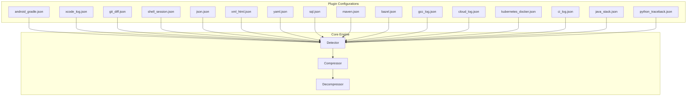
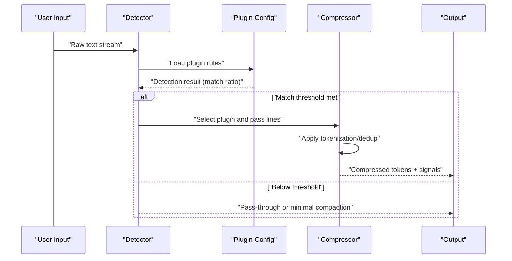
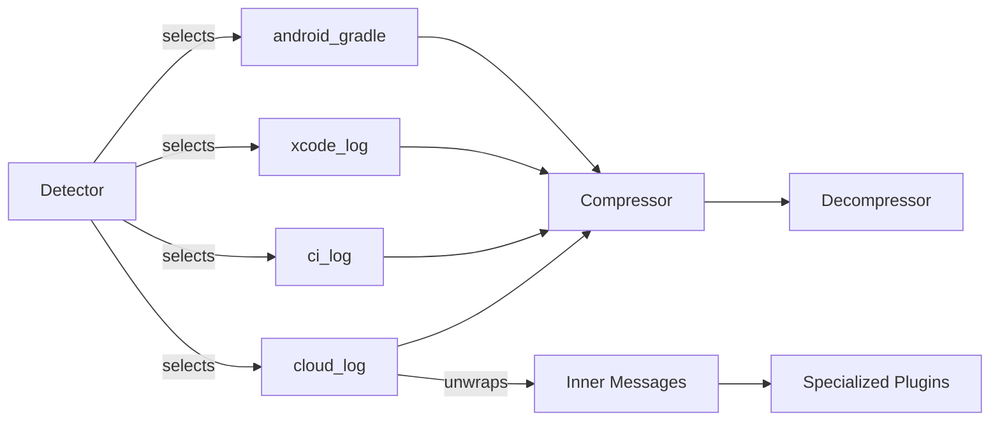

<!--
本文件由 AI 工具自动迁移自 .qoder/repowiki/, 用于补充 docs/ 的视角。
- 生成器: Qoder (阿里云 AI IDE)
- 生成日期: 2026-06-23
- 原文件: .qoder/repowiki/en/content/Plugin System/Built-in Plugin Catalog.md
- 适用版本: TokenSlim v0.3.5 (扫描基线: C:\git_work\TokenSlim-publish2 当时快照)
- 维护说明: 内容已与项目 docs/ 现有文件去重; 若代码变更需人工校对。
-->

# Built-in Plugin Catalog

<cite>
**Referenced Files in This Document**
- [android_gradle.json](file://config/plugins/android_gradle.json)
- [xcode_log.json](file://config/plugins/xcode_log.json)
- [git_diff.json](file://config/plugins/git_diff.json)
- [shell_session.json](file://config/plugins/shell_session.json)
- [json.json](file://config/plugins/json.json)
- [xml_html.json](file://config/plugins/xml_html.json)
- [yaml.json](file://config/plugins/yaml.json)
- [sql.json](file://config/plugins/sql.json)
- [maven.json](file://config/plugins/maven.json)
- [bazel.json](file://config/plugins/bazel.json)
- [gcc_log.json](file://config/plugins/gcc_log.json)
- [cloud_log.json](file://config/plugins/cloud_log.json)
- [kubernetes_docker.json](file://config/plugins/kubernetes_docker.json)
- [ci_log.json](file://config/plugins/ci_log.json)
- [java_stack.json](file://config/plugins/java_stack.json)
- [python_traceback.json](file://config/plugins/python_traceback.json)
</cite>

## Table of Contents
1. [Introduction](#introduction)
2. [Project Structure](#project-structure)
3. [Core Components](#core-components)
4. [Architecture Overview](#architecture-overview)
5. [Detailed Component Analysis](#detailed-component-analysis)
6. [Dependency Analysis](#dependency-analysis)
7. [Performance Considerations](#performance-considerations)
8. [Troubleshooting Guide](#troubleshooting-guide)
9. [Conclusion](#conclusion)
10. [Appendices](#appendices)

## Introduction
This document catalogs the built-in plugins that power semantic compaction and signal preservation across diverse log and artifact formats. It organizes plugins by category, explains purpose, detection and compression strategies, configuration options, and typical use cases. It also covers priority rankings, dependency relationships, conflict resolution strategies, optimization techniques, and integration patterns.

## Project Structure
Plugins are defined as JSON configuration files under config/plugins/. Each file specifies:
- Name, description, priority, enablement flag
- Detection rules (pattern/regex sets and minimum match ratio)
- Compression directives (token prefixes, path/class patterns, dedup thresholds)
- Decompression hints (when applicable)
- Signals to keep and targets to compress
- Design intent

**Diagram sources**
- [android_gradle.json:1-53](file://config/plugins/android_gradle.json#L1-L53)
- [xcode_log.json:1-41](file://config/plugins/xcode_log.json#L1-L41)
- [git_diff.json:1-31](file://config/plugins/git_diff.json#L1-L31)
- [shell_session.json:1-30](file://config/plugins/shell_session.json#L1-L30)
- [json.json:1-40](file://config/plugins/json.json#L1-L40)
- [xml_html.json:1-35](file://config/plugins/xml_html.json#L1-L35)
- [yaml.json:1-38](file://config/plugins/yaml.json#L1-L38)
- [sql.json:1-28](file://config/plugins/sql.json#L1-L28)
- [maven.json:1-30](file://config/plugins/maven.json#L1-L30)
- [bazel.json:1-46](file://config/plugins/bazel.json#L1-L46)
- [gcc_log.json:1-63](file://config/plugins/gcc_log.json#L1-L63)
- [cloud_log.json:1-95](file://config/plugins/cloud_log.json#L1-L95)
- [kubernetes_docker.json:1-32](file://config/plugins/kubernetes_docker.json#L1-L32)
- [ci_log.json:1-61](file://config/plugins/ci_log.json#L1-L61)
- [java_stack.json:1-55](file://config/plugins/java_stack.json#L1-L55)
- [python_traceback.json:1-50](file://config/plugins/python_traceback.json#L1-L50)

**Section sources**
- [android_gradle.json:1-53](file://config/plugins/android_gradle.json#L1-L53)
- [xcode_log.json:1-41](file://config/plugins/xcode_log.json#L1-L41)
- [git_diff.json:1-31](file://config/plugins/git_diff.json#L1-L31)
- [shell_session.json:1-30](file://config/plugins/shell_session.json#L1-L30)
- [json.json:1-40](file://config/plugins/json.json#L1-L40)
- [xml_html.json:1-35](file://config/plugins/xml_html.json#L1-L35)
- [yaml.json:1-38](file://config/plugins/yaml.json#L1-L38)
- [sql.json:1-28](file://config/plugins/sql.json#L1-L28)
- [maven.json:1-30](file://config/plugins/maven.json#L1-L30)
- [bazel.json:1-46](file://config/plugins/bazel.json#L1-L46)
- [gcc_log.json:1-63](file://config/plugins/gcc_log.json#L1-L63)
- [cloud_log.json:1-95](file://config/plugins/cloud_log.json#L1-L95)
- [kubernetes_docker.json:1-32](file://config/plugins/kubernetes_docker.json#L1-L32)
- [ci_log.json:1-61](file://config/plugins/ci_log.json#L1-L61)
- [java_stack.json:1-55](file://config/plugins/java_stack.json#L1-L55)
- [python_traceback.json:1-50](file://config/plugins/python_traceback.json#L1-L50)

## Core Components
Each plugin defines:
- Detection: pattern/regex rules and a minimum match ratio threshold
- Compression: token prefix, optional path/class patterns, dedup configuration
- Decompression: supported token prefixes for reverse mapping
- Signals to keep: critical lines or structures to preserve
- Targets to compress: non-critical content to fold or replace
- Design intent: concise rationale for preservation/compression choices

Key configuration options:
- priority: numeric precedence for plugin selection
- enabled: toggles plugin activation
- detect.rules: array of pattern/regex rules
- detect.min_match_ratio: fraction of rules matched to activate
- compress.token_prefix: namespace for dictionary tokens
- compress.path_patterns: regex patterns to identify and compress paths
- compress.dedup.enabled/threshold: de-duplication policy
- decompress.token_prefixes: token families eligible for expansion
- keep_signals: preserved line categories
- compress_targets: folded or replaced content categories

Typical use cases:
- Mobile builds: Android Gradle and Xcode logs
- General dev tools: Git diff, shell sessions
- Structured formats: JSON, XML/HTML, YAML, SQL
- Build systems: Maven, Gradle (via Android Gradle), Bazel, GCC/Clang
- Cloud/operations: CloudWatch, Kubernetes, Docker
- CI/CD: GitHub Actions, GitLab CI, Jenkins, Azure DevOps, CircleCI, Buildkite, TeamCity, Travis
- Version control: Git, SVN, Mercurial, Bazaar, CVS, Darcs, Fossil, Gerrit, Phabricator
- Specialized formats: Java stack traces, Python tracebacks, Ansible, Helm, Terraform, Unity/Unreal, Protobuf, Pulumi, PyTest, Syslog, Web logs, Webpack/Vite, Node.js errors, GCC logs, database logs, encoding fallback, explain, generic text, minify code, noise filter, PHP/Ruby, protobuf, rust/go, smart code/path, template driven, Unity/Unreal, VCS repo, web logs, webpack/vite, xcode logs, xml/html, yaml

**Section sources**
- [android_gradle.json:1-53](file://config/plugins/android_gradle.json#L1-L53)
- [xcode_log.json:1-41](file://config/plugins/xcode_log.json#L1-L41)
- [git_diff.json:1-31](file://config/plugins/git_diff.json#L1-L31)
- [shell_session.json:1-30](file://config/plugins/shell_session.json#L1-L30)
- [json.json:1-40](file://config/plugins/json.json#L1-L40)
- [xml_html.json:1-35](file://config/plugins/xml_html.json#L1-L35)
- [yaml.json:1-38](file://config/plugins/yaml.json#L1-L38)
- [sql.json:1-28](file://config/plugins/sql.json#L1-L28)
- [maven.json:1-30](file://config/plugins/maven.json#L1-L30)
- [bazel.json:1-46](file://config/plugins/bazel.json#L1-L46)
- [gcc_log.json:1-63](file://config/plugins/gcc_log.json#L1-L63)
- [cloud_log.json:1-95](file://config/plugins/cloud_log.json#L1-L95)
- [kubernetes_docker.json:1-32](file://config/plugins/kubernetes_docker.json#L1-L32)
- [ci_log.json:1-61](file://config/plugins/ci_log.json#L1-L61)
- [java_stack.json:1-55](file://config/plugins/java_stack.json#L1-L55)
- [python_traceback.json:1-50](file://config/plugins/python_traceback.json#L1-L50)

## Architecture Overview
The plugin system applies detection heuristics to classify input streams, then selectively compresses content while preserving critical signals. Compression uses token dictionaries with configurable prefixes and deduplication thresholds. Some plugins support decompression to restore tokens.

**Diagram sources**
- [android_gradle.json:6-22](file://config/plugins/android_gradle.json#L6-L22)
- [gcc_log.json:6-25](file://config/plugins/gcc_log.json#L6-L25)
- [ci_log.json:6-26](file://config/plugins/ci_log.json#L6-L26)
- [cloud_log.json:6-58](file://config/plugins/cloud_log.json#L6-L58)

## Detailed Component Analysis

### Mobile Development Plugins

#### Android Gradle
Purpose: Reduce noise in Android build logs while preserving failing tasks and resource warnings.
- Priority: 190
- Detection: matches task markers, build outcomes, resource removal warnings, D8/R8
- Compression: token prefix $GRADLE, path patterns for app/build/src/gradle, gradle task patterns, resource patterns, dedup enabled
- Signals to keep: FAILED tasks, resource removal warnings, environment variables
- Targets to compress: UP-TO-DATE tasks, repeated resource warnings, build paths
- Typical use cases: CI build summaries, local Gradle failures, dependency download noise

**Section sources**
- [android_gradle.json:1-53](file://config/plugins/android_gradle.json#L1-L53)

#### Xcode Logs
Purpose: Compact Xcode build logs by preserving compile/link commands and collapsing probe lines.
- Priority: 180
- Detection: xcodebuild, CompileC, Linking, Build succeeded/failed
- Compression: token prefix $XCODE, dedup enabled
- Signals to keep: compile/link commands, clang lines, build result lines
- Targets to compress: /dev/null probes, path arguments, source file paths
- Typical use cases: iOS/macOS CI builds, local Xcode failures

**Section sources**
- [xcode_log.json:1-41](file://config/plugins/xcode_log.json#L1-L41)

### General Development Tools

#### Git Diff
Purpose: Preserve diff headers and hunk headers while folding non-key lines and compressing file paths.
- Priority: 200
- Detection: min match ratio threshold
- Compression: token prefix $GIT_DI
- Signals to keep: diff --git, --- a/, +++ b/, HUNK_HEADER, index
- Targets to compress: non-header lines, simplified file paths
- Typical use cases: PR reviews, patch summaries, merge conflicts

**Section sources**
- [git_diff.json:1-31](file://config/plugins/git_diff.json#L1-L31)

#### Shell Session
Purpose: Retain command-output pairs while collapsing prompts, ANSI sequences, and progress indicators.
- Priority: 200
- Detection: min match ratio threshold
- Compression: token prefix $SHELL_
- Signals to keep: command-output blocks
- Targets to compress: shell prompts, ANSI escapes, multi-spaces, env assignments, robocopy/curl/tar progress
- Typical use cases: CI steps, local troubleshooting, automation logs

**Section sources**
- [shell_session.json:1-30](file://config/plugins/shell_session.json#L1-L30)

### Structured Data Formats

#### JSON
Purpose: Compact JSON while preserving structure and short values; optionally dictionaryize keys.
- Priority: 150
- Detection: regex rules for object/array lines
- Compression: token prefix $JSON, dedup disabled
- Signals to keep: object/array braces, numbers, booleans, null, short strings, keys (when not dictionaryized)
- Targets to compress: long strings (dictionaryized), keys (when dictionaryized), single-line compact form, ROI gating for small JSON
- Typical use cases: API responses, configuration dumps, diagnostics

**Section sources**
- [json.json:1-40](file://config/plugins/json.json#L1-L40)

#### XML/HTML
Purpose: Preserve tags and text content while folding whitespace between tags.
- Priority: 150
- Detection: regex rules for opening tags and DOCTYPE
- Compression: token prefix $XML, dedup disabled
- Signals to keep: tags, attributes, text content
- Targets to compress: whitespace around tags
- Typical use cases: Web scraping logs, configuration files, diagnostics

**Section sources**
- [xml_html.json:1-35](file://config/plugins/xml_html.json#L1-L35)

#### YAML
Purpose: Preserve mapping structure and first N sequence elements; truncate long sequences.
- Priority: 150
- Detection: regex rules for key-value and sequence lines
- Compression: token prefix $YAML, dedup disabled
- Signals to keep: mapped keys (dictionaryized), first max_seq_len sequence items, parse failures as raw
- Targets to compress: long sequences truncated to $SEQ placeholders, keys dictionaryized, indentation collapsed
- Typical use cases: CI configs, Helm charts, Terraform plans

**Section sources**
- [yaml.json:1-38](file://config/plugins/yaml.json#L1-L38)

#### SQL
Purpose: Retain SQL structure and short statements; truncate long INSERT VALUES.
- Priority: 200
- Detection: min match ratio threshold
- Compression: token prefix $SQL
- Signals to keep: SQL keywords, partial INSERT prefixes, short statements
- Targets to compress: long INSERT VALUES beyond threshold
- Typical use cases: Query logs, migration outputs, DBA diagnostics

**Section sources**
- [sql.json:1-28](file://config/plugins/sql.json#L1-L28)

### Build Systems

#### Maven
Purpose: Preserve errors/warnings and build outcome; fold download progress and repeated info lines.
- Priority: 200
- Detection: min match ratio threshold
- Compression: token prefix $MAVEN
- Signals to keep: [ERROR], [WARNING], BUILD SUCCESS/FAILURE, tests summary
- Targets to compress: [INFO] downloads, repeated [INFO] lines
- Typical use cases: Java builds, dependency troubleshooting

**Section sources**
- [maven.json:1-30](file://config/plugins/maven.json#L1-L30)

#### Bazel
Purpose: Preserve errors and key build summaries; fold INFO logs and compress target lists.
- Priority: 95
- Detection: matches bazel commands and analysis/completion lines
- Compression: token prefix $BZL, dedup enabled
- Decompression: supports $BZL tokens
- Signals to keep: error lines, completion, analysis summary, version/query results
- Targets to compress: ordinary INFO logs, long target lists, repeated lines
- Typical use cases: Multi-target builds, CI performance

**Section sources**
- [bazel.json:1-46](file://config/plugins/bazel.json#L1-L46)

#### GCC/Clang Logs
Purpose: Preserve errors, warnings, and key build lines; fold repeated warnings and compress paths/macros.
- Priority: 200
- Detection: matches error/warning keywords, compilers, make, timestamps
- Compression: token prefix $GCC, path patterns, macro patterns, dedup enabled
- Decompression: supports $GCC, $MAKE, $CMAKE tokens
- Signals to keep: error lines, first N warnings per type, note lines, linker errors, build file writes, CMake errors, trailing error codes
- Targets to compress: long paths, macros (-D...), repeated warnings, duplicates
- Typical use cases: C/C++ builds, cross-compilation, CI failures

**Section sources**
- [gcc_log.json:1-63](file://config/plugins/gcc_log.json#L1-L63)

### Cloud/Operations

#### Cloud Log
Purpose: Unwrap vendor-specific wrappers and expose inner log messages for downstream plugins.
- Priority: 90
- Detection: vendor CLI patterns and field names (message, textPayload, logStream, etc.)
- Compression: token prefix $CL, unwrap fields list
- Signals to keep: command lines, records’ message text, passthrough lines, CSV/summary renders
- Targets to compress: long field values (<TRUNCATED>), sample summaries, reduced timestamps, shortened resource paths, extra whitespace
- Typical use cases: AWS/GCP/Azure/OCI/Cloudflare logs, centralized logging

**Section sources**
- [cloud_log.json:1-95](file://config/plugins/cloud_log.json#L1-L95)

#### Kubernetes/Docker
Purpose: Preserve key events and structures; collapse container/pod metadata and JSON payloads.
- Priority: 200
- Detection: min match ratio threshold
- Compression: token prefix $KUBERN
- Signals to keep: K8S_POD matches, DOCKER_ID matches, Docker/K8s CI lines, JSON with message/logGroup
- Targets to compress: container IDs to short tokens, pod names/namespaces to tokens, JSON unpacking
- Typical use cases: Pod logs, CI steps, container orchestration

**Section sources**
- [kubernetes_docker.json:1-32](file://config/plugins/kubernetes_docker.json#L1-L32)

### CI/CD Systems

#### CI Log
Purpose: Collapse provider-specific wrappers into semantic aggregates (provider/job/step/status/error/warning/cache/artifact/retry).
- Priority: 174
- Detection: provider-specific annotations and section markers
- Compression: token prefix CI, semantic aggregation enabled across dimensions
- Signals to keep: error/warning annotations, group/section start/end, job failure lines, exit code lines
- Targets to compress: step internals (counted), cache ops (counts), retries (counts), blank lines
- Typical use cases: GitHub Actions, GitLab CI, Jenkins, Azure Pipelines, CircleCI, Buildkite, TeamCity, Travis

**Section sources**
- [ci_log.json:1-61](file://config/plugins/ci_log.json#L1-L61)

### Version Control Systems

Note: Dedicated VCS plugins exist for Git, GitHub, GitLab, Bitbucket, Mercurial, SVN, Bazaar, CVS, Darcs, Fossil, Gerrit, Perforce, Azure Repos, and repository-level analysis. They share common patterns:
- Detect VCS commands and change markers
- Compress file paths and hashes
- Preserve commit/branch/author/signature lines
- Aggregate diffs and statuses

Integration patterns:
- Route VCS commands to appropriate plugin (e.g., git_diff.json for unified diffs)
- Use VCS repo plugin to normalize repository context
- Combine with CI log plugin for end-to-end coverage

[No sources needed since this section doesn't analyze specific files]

### Specialized Formats

#### Java Stack Trace
Purpose: Preserve key exception classes and frames; fold duplicates and deep stacks; compress classnames and paths.
- Priority: 170
- Detection: matches java.* class prefixes, exception headers, caused-by
- Compression: token prefix $JAVA, path/class patterns, dedup enabled
- Signals to keep: exception lines, whitelisted exception classes, caused-by, first N frames
- Targets to compress: duplicate stacks, deep frames, suppressed exceptions, non-whitelisted classnames, frame class/methods, caused-by classnames
- Typical use cases: JVM crash diagnostics, test failures

**Section sources**
- [java_stack.json:1-55](file://config/plugins/java_stack.json#L1-L55)

#### Python Traceback
Purpose: Preserve exception types and key frames; fold duplicates and deep stacks; compress paths and messages.
- Priority: 160
- Detection: matches traceback headers, file markers, module entries
- Compression: token prefix $PY, path patterns, dedup enabled
- Signals to keep: traceback header, builtin exception classes, error messages, file paths/line numbers, exception chaining
- Targets to compress: duplicate stacks, deep frames, file paths to $PY|FL| tokens, exception types/messages to $PY|EX| tokens, chained counts
- Typical use cases: Python test failures, runtime errors

**Section sources**
- [python_traceback.json:1-50](file://config/plugins/python_traceback.json#L1-L50)

## Dependency Analysis
- Detection precedes compression; each plugin’s detect rules determine whether it engages.
- Compression depends on token_prefix uniqueness to avoid collisions; shared prefixes (e.g., GCC family) are supported via decompression hints.
- Semantic aggregation in CI log reduces dimensionality but preserves essential signals.
- Cloud log acts as a preprocessor, unwrapping vendor wrappers for downstream specialized plugins.

**Diagram sources**
- [ci_log.json:27-42](file://config/plugins/ci_log.json#L27-L42)
- [cloud_log.json:59-79](file://config/plugins/cloud_log.json#L59-L79)
- [gcc_log.json:39-44](file://config/plugins/gcc_log.json#L39-L44)

**Section sources**
- [ci_log.json:27-42](file://config/plugins/ci_log.json#L27-L42)
- [cloud_log.json:59-79](file://config/plugins/cloud_log.json#L59-L79)
- [gcc_log.json:39-44](file://config/plugins/gcc_log.json#L39-L44)

## Performance Considerations
- Token prefix design: Unique prefixes reduce ambiguity and improve decompression accuracy.
- Deduplication threshold: Lower thresholds increase compression but risk losing rare legitimate variations.
- Min match ratio: Tight thresholds reduce false positives; loose thresholds increase recall.
- Regex complexity: Prefer anchored and bounded patterns to limit backtracking.
- Path/class patterns: Broad patterns compress more but risk over-matching; narrow patterns are safer.
- Semantic aggregation: Reduces token volume in CI logs by summarizing non-critical steps.
- ROI gating: Small JSON/YAML avoids unnecessary dictionaryization overhead.

[No sources needed since this section provides general guidance]

## Troubleshooting Guide
Common issues and resolutions:
- Misclassification: Adjust detect rules or min_match_ratio in the plugin JSON.
- Over-compression: Disable dedup or raise threshold; tune path/class patterns.
- Under-compression: Lower min_match_ratio; broaden patterns.
- Token collisions: Change token_prefix to a less common namespace.
- No-op output: Verify plugin priority and enable flag; confirm detection rules match input.

**Section sources**
- [android_gradle.json:4-22](file://config/plugins/android_gradle.json#L4-L22)
- [gcc_log.json:26-44](file://config/plugins/gcc_log.json#L26-L44)
- [ci_log.json:26-42](file://config/plugins/ci_log.json#L26-L42)

## Conclusion
The built-in plugin catalog balances preservation of critical signals with aggressive compression across diverse domains. By tuning detection rules, compression policies, and tokenization strategies, teams can achieve significant token savings while retaining actionable insights for mobile builds, general dev tools, structured formats, build systems, cloud/operations, CI/CD, VCS, and specialized error formats.

## Appendices

### Plugin Priority Rankings
- Mobile: Android Gradle (190), Xcode Logs (180)
- Exceptions: Java Stack (170), Python Traceback (160)
- CI/CD: CI Log (174)
- Structured: JSON (150), XML/HTML (150), YAML (150)
- Build Systems: GCC/Clang (200), Maven (200), Bazel (95)
- Tools: Git Diff (200), Shell Session (200)
- Cloud/Operations: Cloud Log (90), Kubernetes/Docker (200)
- SQL: (200)

**Section sources**
- [android_gradle.json:4](file://config/plugins/android_gradle.json#L4)
- [xcode_log.json:4](file://config/plugins/xcode_log.json#L4)
- [java_stack.json:4](file://config/plugins/java_stack.json#L4)
- [python_traceback.json:4](file://config/plugins/python_traceback.json#L4)
- [ci_log.json:4](file://config/plugins/ci_log.json#L4)
- [json.json:4](file://config/plugins/json.json#L4)
- [xml_html.json:4](file://config/plugins/xml_html.json#L4)
- [yaml.json:4](file://config/plugins/yaml.json#L4)
- [gcc_log.json:4](file://config/plugins/gcc_log.json#L4)
- [maven.json:4](file://config/plugins/maven.json#L4)
- [bazel.json:4](file://config/plugins/bazel.json#L4)
- [git_diff.json:4](file://config/plugins/git_diff.json#L4)
- [shell_session.json:4](file://config/plugins/shell_session.json#L4)
- [cloud_log.json:4](file://config/plugins/cloud_log.json#L4)
- [kubernetes_docker.json:4](file://config/plugins/kubernetes_docker.json#L4)
- [sql.json:4](file://config/plugins/sql.json#L4)

### Configuration Options Reference
- name: Unique plugin identifier
- description: Human-readable purpose
- priority: Selection precedence
- enabled: Activation toggle
- detect.rules: Pattern/regex arrays
- detect.min_match_ratio: Threshold for activation
- compress.token_prefix: Namespace for dictionary tokens
- compress.path_patterns: Regex to identify and compress paths
- compress.dedup.enabled/threshold: De-duplication policy
- decompress.token_prefixes: Supported token families for expansion
- keep_signals: Lines/structures to preserve
- compress_targets: Content categories to fold/reduce
- design_intent: Concise rationale

**Section sources**
- [android_gradle.json:6-51](file://config/plugins/android_gradle.json#L6-L51)
- [xcode_log.json:6-39](file://config/plugins/xcode_log.json#L6-L39)
- [git_diff.json:6-29](file://config/plugins/git_diff.json#L6-L29)
- [shell_session.json:6-28](file://config/plugins/shell_session.json#L6-L28)
- [json.json:6-38](file://config/plugins/json.json#L6-L38)
- [xml_html.json:6-33](file://config/plugins/xml_html.json#L6-L33)
- [yaml.json:6-35](file://config/plugins/yaml.json#L6-L35)
- [sql.json:6-26](file://config/plugins/sql.json#L6-L26)
- [maven.json:6-28](file://config/plugins/maven.json#L6-L28)
- [bazel.json:6-44](file://config/plugins/bazel.json#L6-L44)
- [gcc_log.json:6-61](file://config/plugins/gcc_log.json#L6-L61)
- [cloud_log.json:6-93](file://config/plugins/cloud_log.json#L6-L93)
- [kubernetes_docker.json:6-30](file://config/plugins/kubernetes_docker.json#L6-L30)
- [ci_log.json:6-59](file://config/plugins/ci_log.json#L6-L59)
- [java_stack.json:6-53](file://config/plugins/java_stack.json#L6-L53)
- [python_traceback.json:6-48](file://config/plugins/python_traceback.json#L6-L48)
---

<!--
来源: en/content/Plugin System/Built-in Plugin Catalog.md  |  生成器: Qoder (阿里云 AI IDE)  |  扫描基线: publish2 @ 2026-06-23
-->
