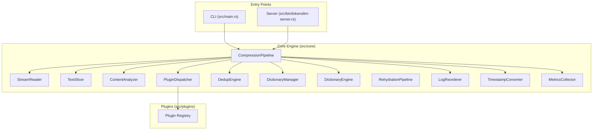
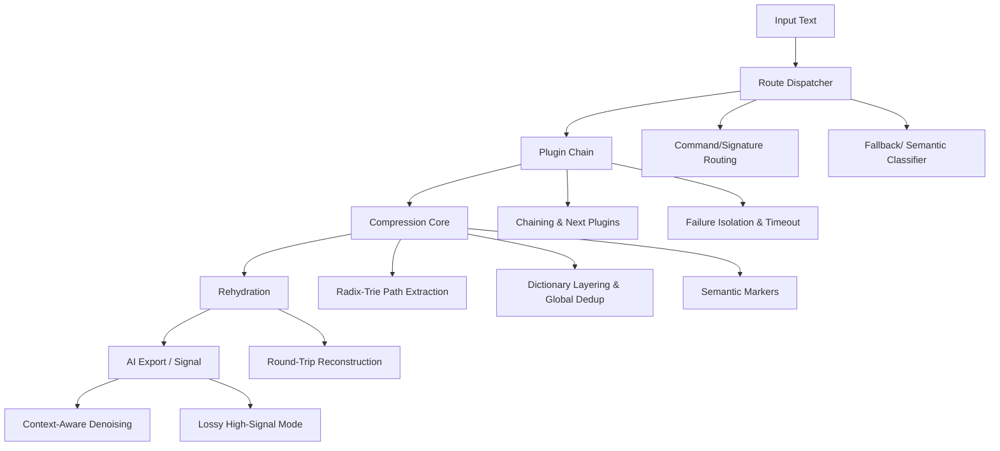
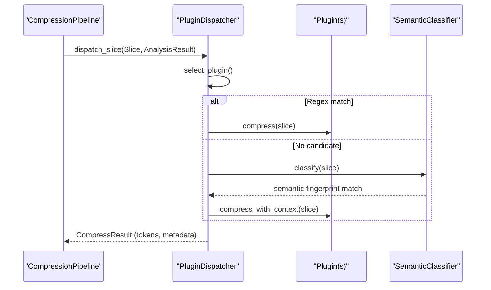
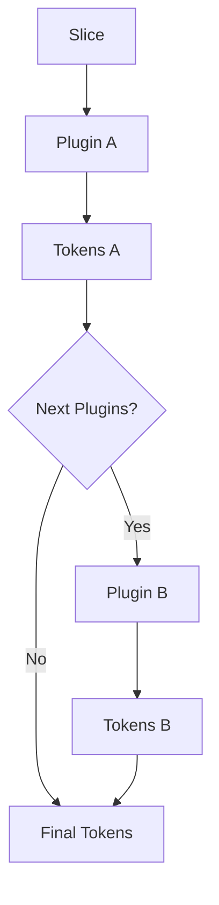
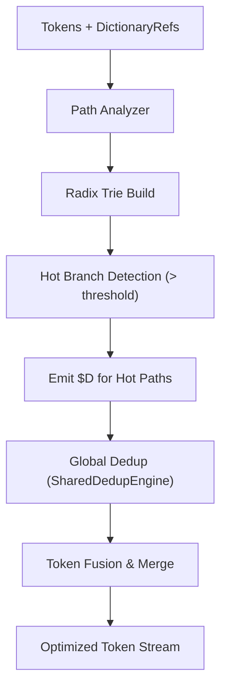
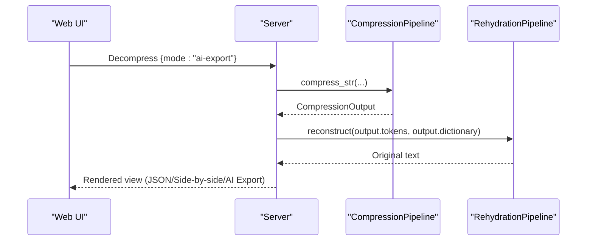
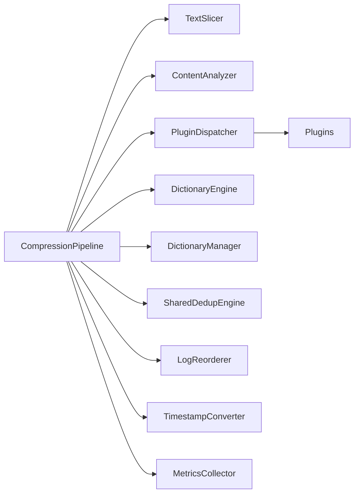

<!--
本文件由 AI 工具自动迁移自 .qoder/repowiki/, 用于补充 docs/ 的视角。
- 生成器: Qoder (阿里云 AI IDE)
- 生成日期: 2026-06-23
- 原文件: .qoder/repowiki/en/content/Project Overview/Architecture Overview.md
- 适用版本: TokenSlim v0.3.5 (扫描基线: C:\git_work\TokenSlim-publish2 当时快照)
- 维护说明: 内容已与项目 docs/ 现有文件去重; 若代码变更需人工校对。
-->

# Architecture Overview

<cite>
**Referenced Files in This Document**
- [README.md](file://README.md)
- [ARCHITECTURE.md](file://docs/development/ARCHITECTURE.md)
- [compression_pipeline.md](file://docs/design/compression_pipeline.md)
- [plugin_dispatcher.md](file://docs/design/plugin_dispatcher.md)
- [compression.md](file://docs/design/compression.md)
- [tokenslim-server.rs](file://src/bin/tokenslim-server.rs)
- [main.rs](file://src/main.rs)
- [lib.rs](file://src/lib.rs)
</cite>

## Table of Contents
1. [Introduction](#introduction)
2. [Project Structure](#project-structure)
3. [Core Components](#core-components)
4. [Architecture Overview](#architecture-overview)
5. [Detailed Component Analysis](#detailed-component-analysis)
6. [Dependency Analysis](#dependency-analysis)
7. [Performance Considerations](#performance-considerations)
8. [Troubleshooting Guide](#troubleshooting-guide)
9. [Conclusion](#conclusion)

## Introduction
TokenSlim is a high-performance, plugin-based text compression engine for LLM inputs. It reduces token counts by 50–95% on repetitive, structured logs (builds, CI runs, web/cloud logs, VCS output, stack traces) while preserving diagnostic signals needed by language models. The system is built around a layered pipeline with five stages: Route dispatcher, Plugin chain, Compression core, Rehydration, and AI Export/Signal processing. It features:
- Deterministic global reordering to resolve out-of-order interleaving in parallel builds
- Radix-trie path extraction and semantic markers for robust dictionary reuse
- A plugin-based architecture enabling dynamic content-type detection and processing
- Zero-copy pipeline design with parallel block processing for high throughput

## Project Structure
TokenSlim organizes functionality into a modular Rust architecture:
- Core engine modules under src/core/ implement the pipeline stages and shared utilities
- Plugin ecosystem under src/plugins/ provides specialized processors for diverse input types
- CLI and server entry points under src/bin/ expose compression/decompression APIs
- Design and development docs under docs/ describe the architecture and extension points

**Diagram sources**
- [ARCHITECTURE.md:67-151](file://docs/development/ARCHITECTURE.md#L67-L151)
- [compression_pipeline.md:25-88](file://docs/design/compression_pipeline.md#L25-L88)
- [plugin_dispatcher.md:17-95](file://docs/design/plugin_dispatcher.md#L17-L95)

**Section sources**
- [ARCHITECTURE.md:25-63](file://docs/development/ARCHITECTURE.md#L25-L63)
- [lib.rs:16-64](file://src/lib.rs#L16-L64)

## Core Components
TokenSlim’s core engine defines shared data structures and orchestrates the five-stage pipeline. The compression module centralizes token representation, compression output, and metadata, while the compression pipeline coordinates stream reading, slicing, analysis, plugin dispatching, dictionary management, deduplication, and metrics collection.

Key responsibilities:
- Compression module: Defines Token enumeration, CompressionOutput, CompressionMetadata, and auxiliary types
- Compression pipeline: Drives serial and parallel processing, manages shared engines, and aggregates results
- Plugin dispatcher: Selects appropriate plugins per slice, supports chaining, and isolates failures
- Dictionary manager/engine: Manages dictionary lifecycles and enables cross-slice reuse
- Log reorderer: Ensures deterministic ordering for parallel builds
- Metrics collector: Tracks processing statistics

**Section sources**
- [compression.md:1-13](file://docs/design/compression.md#L1-L13)
- [compression_pipeline.md:5-23](file://docs/design/compression_pipeline.md#L5-L23)
- [plugin_dispatcher.md:3-14](file://docs/design/plugin_dispatcher.md#L3-L14)

## Architecture Overview
The five-stage pipeline transforms raw text into compact token streams with embedded dictionaries and metadata:

1) Route dispatcher
- Determines the optimal plugin(s) based on command or content signature
- Supports fallbacks and AI-assisted semantic classification when regex-based detection is insufficient

2) Plugin chain
- Executes one or more plugins in sequence, optionally passing intermediate text results downstream
- Enforces timeouts, panics isolation, and circuit breaker behavior

3) Compression core
- Builds dictionaries and performs global deduplication
- Extracts paths using a radix-trie and applies semantic markers for environment-aware substitutions
- Produces a token stream enriched with dictionary references

4) Rehydration
- Fully reconstructs the original input from the compressed token stream and dictionary
- Maintains round-trip safety for accurate auditability

5) AI Export/Signal processing
- Applies context-aware denoising and selective signal extraction for LLM consumption
- Provides “ai-export” and “ai-signal” modes to balance fidelity and conciseness

**Diagram sources**
- [README.md:382-392](file://README.md#L382-L392)
- [plugin_dispatcher.md:107-132](file://docs/design/plugin_dispatcher.md#L107-L132)
- [compression_pipeline.md:8-23](file://docs/design/compression_pipeline.md#L8-L23)

**Section sources**
- [README.md:382-392](file://README.md#L382-L392)
- [ARCHITECTURE.md:67-151](file://docs/development/ARCHITECTURE.md#L67-L151)

## Detailed Component Analysis

### Route Dispatcher
The route dispatcher selects plugins based on either explicit commands or content signatures. It records parse tier and reasons for observability and supports:
- Plugin chaining via next_plugins declarations
- AI-assisted fallback using semantic similarity when regex confidence is low
- Safe execution with timeouts and panic isolation

**Diagram sources**
- [plugin_dispatcher.md:148-190](file://docs/design/plugin_dispatcher.md#L148-L190)
- [plugin_dispatcher.md:117-123](file://docs/design/plugin_dispatcher.md#L117-L123)

**Section sources**
- [plugin_dispatcher.md:101-132](file://docs/design/plugin_dispatcher.md#L101-L132)
- [plugin_dispatcher.md:148-190](file://docs/design/plugin_dispatcher.md#L148-L190)

### Plugin Chain
Plugins operate on slices and can form chains. Each plugin receives a mutable dictionary engine and dedup engine, enabling cross-slice reuse and global deduplication. The dispatcher enforces:
- Priority-based selection among matching plugins
- Optional detect() confidence gating
- Depth-limited chaining to prevent cycles

**Diagram sources**
- [plugin_dispatcher.md:107-116](file://docs/design/plugin_dispatcher.md#L107-L116)

**Section sources**
- [plugin_dispatcher.md:107-116](file://docs/design/plugin_dispatcher.md#L107-L116)

### Compression Core
The compression core orchestrates dictionary building, path extraction, and global deduplication:
- DictionaryEngine and DictionaryManager coordinate dictionary lifecycle and sharing
- Path compressor leverages radix-trie extraction to emit directory dictionaries ($D) on hot branches
- SharedDedupEngine ensures cross-slice deduplication across parallel chunks
- TimestampConverter normalizes timestamps; LogReorderer stabilizes parallel build order

**Diagram sources**
- [compression_pipeline.md:18-23](file://docs/design/compression_pipeline.md#L18-L23)
- [ARCHITECTURE.md:121-129](file://docs/development/ARCHITECTURE.md#L121-L129)

**Section sources**
- [compression_pipeline.md:18-23](file://docs/design/compression_pipeline.md#L18-L23)
- [ARCHITECTURE.md:121-129](file://docs/development/ARCHITECTURE.md#L121-L129)

### Rehydration
Rehydration reconstructs the original input from the compressed token stream and dictionary. It validates round-trip safety and supports side-by-side comparison views in the Web UI.

**Diagram sources**
- [tokenslim-server.rs:868-894](file://src/bin/tokenslim-server.rs#L868-L894)

**Section sources**
- [tokenslim-server.rs:868-894](file://src/bin/tokenslim-server.rs#L868-L894)

### AI Export/Signal Processing
AI-native modes tailor outputs for LLM consumption:
- AI Export: context-aware denoising that retains error/warning windows
- AI Signal: lossy but high-signal mode preserving decision-relevant fields

These modes integrate with the rehydration pipeline to present curated views.

**Section sources**
- [README.md:154-156](file://README.md#L154-L156)
- [README.md:183-186](file://README.md#L183-L186)

## Dependency Analysis
The pipeline composes multiple modules with clear boundaries and shared ownership:
- CompressionPipeline aggregates TextSlicer, ContentAnalyzer, PluginDispatcher, DictionaryEngine, DictionaryManager, SharedDedupEngine, LogReorderer, TimestampConverter, and MetricsCollector
- PluginDispatcher depends on registered plugins and a safe executor
- DictionaryManager is shared across pipeline stages to enable cross-slice reuse
- Parallel path uses rayon to process 5MB chunks independently, each with its own engines

**Diagram sources**
- [compression_pipeline.md:75-87](file://docs/design/compression_pipeline.md#L75-L87)
- [ARCHITECTURE.md:114-149](file://docs/development/ARCHITECTURE.md#L114-L149)

**Section sources**
- [compression_pipeline.md:131-145](file://docs/design/compression_pipeline.md#L131-L145)
- [ARCHITECTURE.md:114-149](file://docs/development/ARCHITECTURE.md#L114-L149)

## Performance Considerations
- Zero-copy pipeline leveraging Cow<'a, str> and Bump arena allocation
- Parallel block processing with rayon for large inputs (≥256KB)
- Streaming build-target tracking to eliminate乱序 in parallel builds
- Deterministic global reordering for consistent error stacks across identical parallel builds
- Sidecar mode for high-throughput REST API with SSE streaming support

[No sources needed since this section provides general guidance]

## Troubleshooting Guide
Common operational checks:
- Verify plugin selection and fallback behavior using explain routes and plugin introspection
- Monitor parse tier and reasons for observability (full/degraded/passthrough)
- Inspect metrics for processing time, slice counts, and compression ratios
- Use server-side SSE streaming for large inputs to avoid UI blocking

**Section sources**
- [plugin_dispatcher.md:101-106](file://docs/design/plugin_dispatcher.md#L101-L106)
- [compression_pipeline.md:125-128](file://docs/design/compression_pipeline.md#L125-L128)

## Conclusion
TokenSlim’s layered pipeline integrates dynamic plugin routing, robust dictionary management, and deterministic reordering to deliver high compression ratios on repetitive, structured logs. The plugin-based architecture enables extensibility, while the compression core and rehydration pipeline ensure fidelity and round-trip safety. AI Export/Signal modes further tailor outputs for LLM consumption, balancing fidelity and conciseness.

[No sources needed since this section summarizes without analyzing specific files]
---

<!--
来源: en/content/Project Overview/Architecture Overview.md  |  生成器: Qoder (阿里云 AI IDE)  |  扫描基线: publish2 @ 2026-06-23
-->
