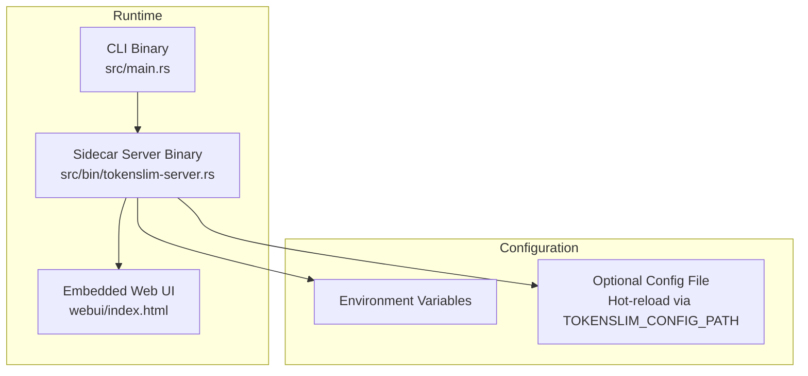
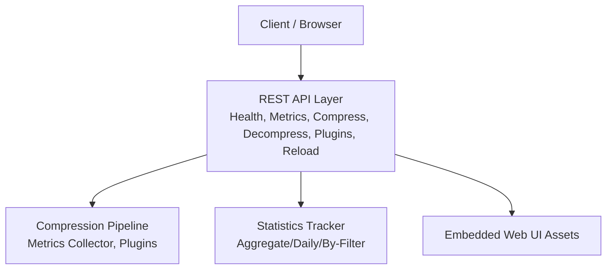
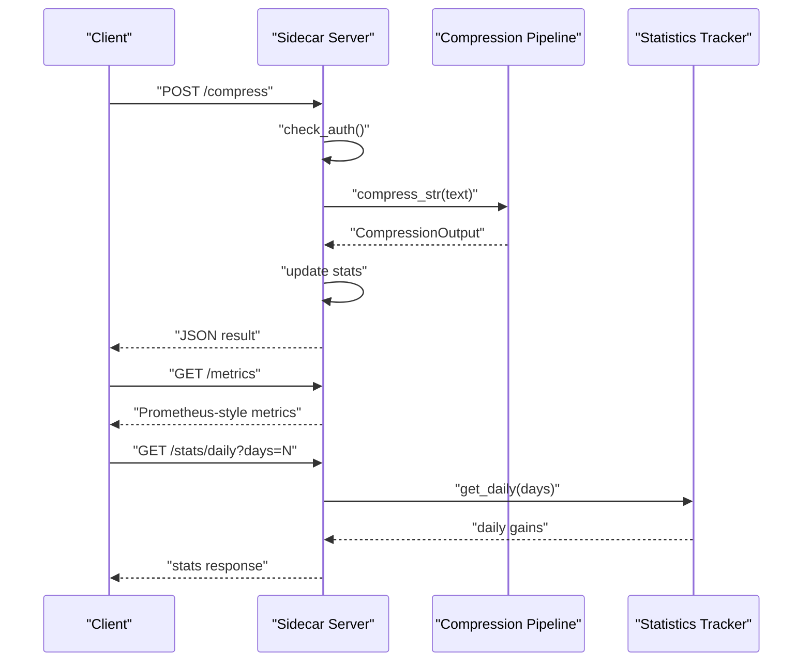
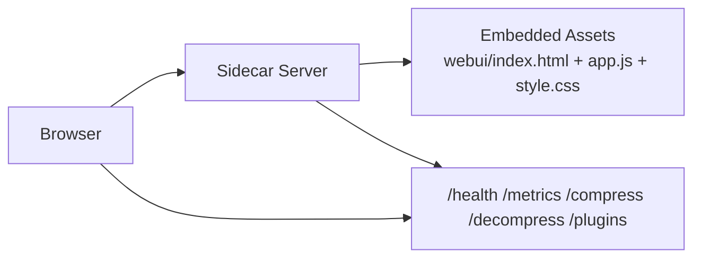
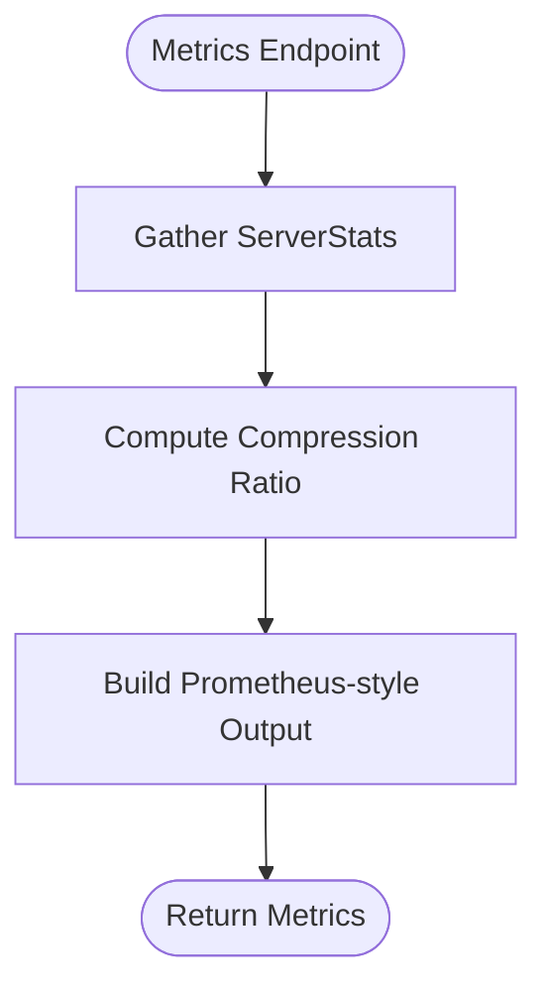
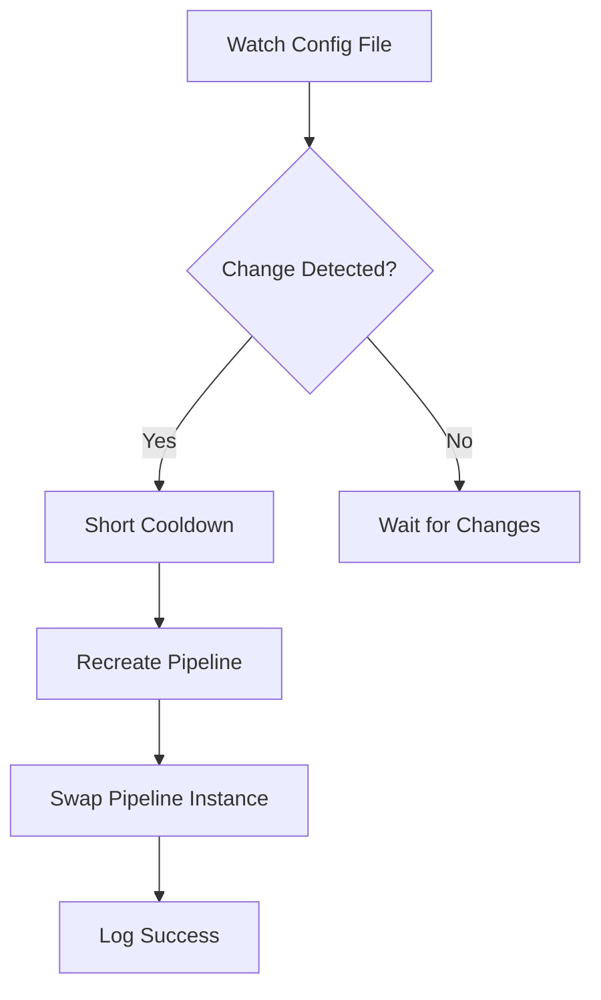
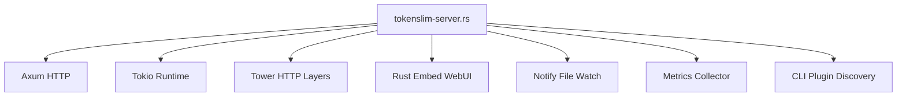
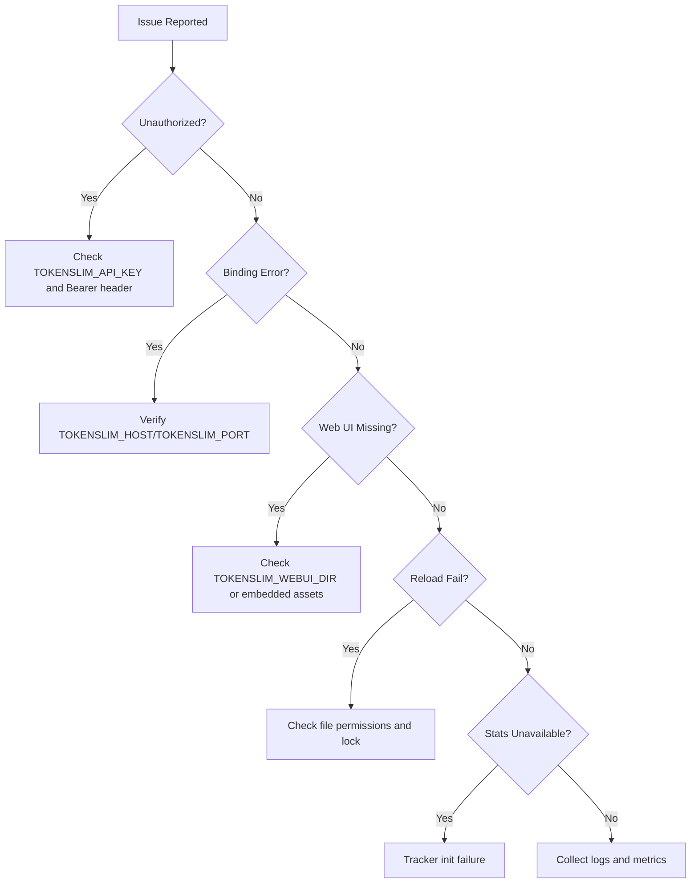

<!--
本文件由 AI 工具自动迁移自 .qoder/repowiki/, 用于补充 docs/ 的视角。
- 生成器: Qoder (阿里云 AI IDE)
- 生成日期: 2026-06-23
- 原文件: .qoder/repowiki/en/content/Deployment and Operations.md
- 适用版本: TokenSlim v0.3.5 (扫描基线: C:\git_work\TokenSlim-publish2 当时快照)
- 维护说明: 内容已与项目 docs/ 现有文件去重; 若代码变更需人工校对。
-->

# Deployment and Operations

<cite>
**Referenced Files in This Document**
- [README.md](file://README.md)
- [Cargo.toml](file://Cargo.toml)
- [src/main.rs](file://src/main.rs)
- [src/bin/tokenslim-server.rs](file://src/bin/tokenslim-server.rs)
- [webui/index.html](file://webui/index.html)
- [.github/workflows](file://.github/workflows)
- [scripts/release_smoke_gate.ps1](file://scripts/release_smoke_gate.ps1)
- [scripts/bump-version.mjs](file://scripts/bump-version.mjs)
- [tests/server_webui_e2e.rs](file://tests/server_webui_e2e.rs)
</cite>

## Table of Contents
1. [Introduction](#introduction)
2. [Project Structure](#project-structure)
3. [Core Components](#core-components)
4. [Architecture Overview](#architecture-overview)
5. [Detailed Component Analysis](#detailed-component-analysis)
6. [Dependency Analysis](#dependency-analysis)
7. [Performance Considerations](#performance-considerations)
8. [Troubleshooting Guide](#troubleshooting-guide)
9. [Conclusion](#conclusion)
10. [Appendices](#appendices)

## Introduction
This document provides comprehensive deployment and operations guidance for TokenSlim, focusing on production-ready strategies for containerization, orchestration, and cloud deployments. It explains the sidecar deployment model for high-throughput environments, the embedded web UI architecture, monitoring and logging configuration, maintenance procedures, scaling and load balancing, security hardening, troubleshooting, and the release process including smoke testing and rollback strategies.

## Project Structure
TokenSlim is a Rust project with a sidecar server binary exposing a REST API and an embedded web UI. The repository includes:
- A server binary implementing REST endpoints for compression, decompression, metrics, statistics, and configuration reload.
- An embedded web UI compiled directly into the server binary via a Rust embedding mechanism.
- CLI entrypoint for local usage and development.
- Configuration via environment variables and optional hot-reload of configuration files.
- Test coverage including an end-to-end test for the server web UI.

**Diagram sources**
- [src/main.rs:1-42](file://src/main.rs#L1-L42)
- [src/bin/tokenslim-server.rs:1-396](file://src/bin/tokenslim-server.rs#L1-L396)
- [webui/index.html:1-100](file://webui/index.html#L1-L100)

**Section sources**
- [README.md:272-334](file://README.md#L272-L334)
- [src/bin/tokenslim-server.rs:355-370](file://src/bin/tokenslim-server.rs#L355-L370)

## Core Components
- Sidecar server binary: Provides health, metrics, compression/decompression endpoints, SSE live tail, plugin listing, and configuration reload. Supports API key authentication and hot-reload of configuration.
- Embedded web UI: Single-page application compiled into the server binary; served either from an external directory (development) or embedded assets (production).
- CLI entrypoint: Initializes logging and delegates to the CLI runtime; supports verbose logging via environment variables.
- Metrics and statistics: Built-in Prometheus-style metrics endpoint and detailed metrics with per-module timings and plugin statistics. Optional persistent statistics via a tracker.

Key operational environment variables:
- Host binding and port
- Web UI directory override
- API key enforcement
- Configuration path for hot-reload
- Logging verbosity

**Section sources**
- [src/bin/tokenslim-server.rs:306-310](file://src/bin/tokenslim-server.rs#L306-L310)
- [src/bin/tokenslim-server.rs:373-395](file://src/bin/tokenslim-server.rs#L373-L395)
- [src/bin/tokenslim-server.rs:414-473](file://src/bin/tokenslim-server.rs#L414-L473)
- [src/bin/tokenslim-server.rs:475-564](file://src/bin/tokenslim-server.rs#L475-L564)
- [src/bin/tokenslim-server.rs:280-286](file://src/bin/tokenslim-server.rs#L280-L286)
- [README.md:306-316](file://README.md#L306-L316)

## Architecture Overview
TokenSlim’s sidecar architecture enables high-throughput, low-latency compression/decompression for LLM inputs. The server exposes:
- Health and metrics endpoints
- Compression and decompression APIs
- SSE live tail for large inputs
- Plugin discovery
- Configuration reload
- Optional API key authentication

The embedded web UI consumes the same JSON endpoints, enabling interactive compression and diagnostics.

**Diagram sources**
- [src/bin/tokenslim-server.rs:338-353](file://src/bin/tokenslim-server.rs#L338-L353)
- [src/bin/tokenslim-server.rs:414-473](file://src/bin/tokenslim-server.rs#L414-L473)
- [src/bin/tokenslim-server.rs:566-671](file://src/bin/tokenslim-server.rs#L566-L671)
- [webui/index.html:1-100](file://webui/index.html#L1-L100)

**Section sources**
- [README.md:272-334](file://README.md#L272-L334)
- [src/bin/tokenslim-server.rs:338-396](file://src/bin/tokenslim-server.rs#L338-L396)

## Detailed Component Analysis

### Sidecar Server Deployment Model
The sidecar model is ideal for high-throughput environments because:
- Zero startup overhead for repeated calls
- Long-lived process with in-memory plugin cache
- Streaming SSE support for large inputs
- Embedded web UI for diagnostics and testing

Operational controls:
- Authentication: Optional API key enforcement via environment variable
- Binding: Host and port configurable via environment variables
- Web UI: Embedded assets by default; development override supported
- Hot reload: Optional configuration file watching and reload

**Diagram sources**
- [src/bin/tokenslim-server.rs:763-807](file://src/bin/tokenslim-server.rs#L763-L807)
- [src/bin/tokenslim-server.rs:414-473](file://src/bin/tokenslim-server.rs#L414-L473)
- [src/bin/tokenslim-server.rs:597-635](file://src/bin/tokenslim-server.rs#L597-L635)

**Section sources**
- [src/bin/tokenslim-server.rs:245-259](file://src/bin/tokenslim-server.rs#L245-L259)
- [src/bin/tokenslim-server.rs:373-395](file://src/bin/tokenslim-server.rs#L373-L395)
- [src/bin/tokenslim-server.rs:355-370](file://src/bin/tokenslim-server.rs#L355-L370)

### Embedded Web UI Architecture
The web UI is compiled into the server binary and served statically. It communicates with the same JSON endpoints used by the CLI, enabling:
- Interactive compression and decompression
- Live tailing via SSE
- History and plugin-hit lists
- Localization and responsive layout

**Diagram sources**
- [webui/index.html:1-100](file://webui/index.html#L1-L100)
- [src/bin/tokenslim-server.rs:355-370](file://src/bin/tokenslim-server.rs#L355-L370)
- [src/bin/tokenslim-server.rs:338-353](file://src/bin/tokenslim-server.rs#L338-L353)

**Section sources**
- [README.md:279-334](file://README.md#L279-L334)
- [webui/index.html:1-100](file://webui/index.html#L1-L100)

### Metrics and Statistics
Built-in metrics include:
- Request counters and byte totals
- Compression ratio
- Uptime
- Detailed module timings and plugin statistics
- Error logs with timestamps and slice IDs

Statistics endpoints:
- Aggregate gains
- Daily gains
- By-filter gains

**Diagram sources**
- [src/bin/tokenslim-server.rs:414-473](file://src/bin/tokenslim-server.rs#L414-L473)

**Section sources**
- [src/bin/tokenslim-server.rs:414-473](file://src/bin/tokenslim-server.rs#L414-L473)
- [src/bin/tokenslim-server.rs:475-564](file://src/bin/tokenslim-server.rs#L475-L564)
- [src/bin/tokenslim-server.rs:566-671](file://src/bin/tokenslim-server.rs#L566-L671)

### Configuration and Hot Reload
- Optional configuration path enables file watching and automatic pipeline reload
- Reload endpoint allows explicit reload with authentication
- Useful for updating plugin configurations without downtime

**Diagram sources**
- [src/bin/tokenslim-server.rs:709-761](file://src/bin/tokenslim-server.rs#L709-L761)
- [src/bin/tokenslim-server.rs:673-707](file://src/bin/tokenslim-server.rs#L673-L707)

**Section sources**
- [src/bin/tokenslim-server.rs:301-310](file://src/bin/tokenslim-server.rs#L301-L310)
- [src/bin/tokenslim-server.rs:709-761](file://src/bin/tokenslim-server.rs#L709-L761)
- [src/bin/tokenslim-server.rs:673-707](file://src/bin/tokenslim-server.rs#L673-L707)

## Dependency Analysis
TokenSlim’s server binary depends on:
- Asynchronous runtime and HTTP stack
- Metrics and tracing libraries
- File watching for hot reload
- Embedded web UI assets
- CLI runtime for plugin discovery

**Diagram sources**
- [Cargo.toml:25-74](file://Cargo.toml#L25-L74)
- [src/bin/tokenslim-server.rs:1-31](file://src/bin/tokenslim-server.rs#L1-L31)

**Section sources**
- [Cargo.toml:25-74](file://Cargo.toml#L25-L74)
- [src/bin/tokenslim-server.rs:1-31](file://src/bin/tokenslim-server.rs#L1-L31)

## Performance Considerations
- Sidecar mode eliminates cold-start latency for repeated operations.
- Streaming SSE support prevents UI blocking for large inputs.
- Parallel processing and zero-copy pipeline enable high throughput.
- Metrics and module timings help identify bottlenecks.
- Use hot reload for configuration changes without restarts.

[No sources needed since this section provides general guidance]

## Troubleshooting Guide
Common operational issues and resolutions:
- Unauthorized access attempts: Verify API key configuration and Authorization header.
- Invalid host/port binding: Confirm environment variables and fallback behavior.
- Web UI not loading: Ensure embedded assets are enabled or development directory is correct.
- Configuration reload failures: Check file permissions and lock acquisition during swap.
- Missing statistics: Tracker initialization may fail; statistics endpoints will return service unavailable.

**Section sources**
- [src/bin/tokenslim-server.rs:245-259](file://src/bin/tokenslim-server.rs#L245-L259)
- [src/bin/tokenslim-server.rs:373-395](file://src/bin/tokenslim-server.rs#L373-L395)
- [src/bin/tokenslim-server.rs:355-370](file://src/bin/tokenslim-server.rs#L355-L370)
- [src/bin/tokenslim-server.rs:709-761](file://src/bin/tokenslim-server.rs#L709-L761)
- [src/bin/tokenslim-server.rs:566-595](file://src/bin/tokenslim-server.rs#L566-L595)

## Conclusion
TokenSlim’s sidecar architecture, combined with embedded web UI and comprehensive metrics, provides a robust foundation for production deployments. Use environment variables for configuration, enforce API key authentication in shared environments, leverage hot reload for safe configuration updates, and monitor metrics and statistics for operational visibility. Scale horizontally with load balancers and ensure secure access controls and data protection.

[No sources needed since this section summarizes without analyzing specific files]

## Appendices

### Production Deployment Strategies
- Containerization: Package the server binary with minimal base image; mount configuration file if needed; expose port configured via environment variables.
- Orchestration: Deploy as a stateless service behind a load balancer; enable health checks against the health endpoint.
- Cloud deployment patterns: Use managed platforms supporting stateless containers; configure secrets for API keys and environment variables.

[No sources needed since this section provides general guidance]

### Monitoring and Logging Configuration
- Enable RUST_LOG for desired verbosity.
- Collect Prometheus metrics from the metrics endpoint.
- Use detailed metrics to analyze module timings and plugin performance.
- Track statistics via aggregate/daily/by-filter endpoints.

**Section sources**
- [README.md:220-223](file://README.md#L220-L223)
- [src/bin/tokenslim-server.rs:414-473](file://src/bin/tokenslim-server.rs#L414-L473)
- [src/bin/tokenslim-server.rs:475-564](file://src/bin/tokenslim-server.rs#L475-L564)
- [src/bin/tokenslim-server.rs:566-671](file://src/bin/tokenslim-server.rs#L566-L671)

### Maintenance Procedures
- Updates: Roll out new server binary; use reload endpoint or restart depending on configuration changes.
- Backups: Preserve configuration files and statistics database if used.
- Disaster recovery: Restore configuration and redeploy server; verify health and metrics endpoints.

[No sources needed since this section provides general guidance]

### Scaling and Load Balancing
- Horizontal scaling: Run multiple instances behind a load balancer; ensure sticky sessions are not required.
- Load balancing: Use health checks against the health endpoint; distribute traffic evenly.
- Sidecar placement: Place sidecar close to consumers to minimize network latency.

[No sources needed since this section provides general guidance]

### Security Hardening and Access Control
- Enforce API key authentication via environment variable.
- Restrict host binding to loopback or private networks; expose via reverse proxy with TLS termination.
- Protect configuration files and secrets; avoid embedding sensitive data in configuration.

**Section sources**
- [src/bin/tokenslim-server.rs:280-286](file://src/bin/tokenslim-server.rs#L280-L286)
- [src/bin/tokenslim-server.rs:245-259](file://src/bin/tokenslim-server.rs#L245-L259)

### Release Process, Smoke Testing, and Rollback
- Version bumping: Use provided script to update version consistently.
- Smoke testing: Run release smoke gate script to validate server and web UI.
- Rollback: Re-deploy previous version; verify endpoints and UI functionality.

**Section sources**
- [scripts/bump-version.mjs](file://scripts/bump-version.mjs)
- [scripts/release_smoke_gate.ps1](file://scripts/release_smoke_gate.ps1)
- [tests/server_webui_e2e.rs](file://tests/server_webui_e2e.rs)
---

<!--
来源: en/content/Deployment and Operations.md  |  生成器: Qoder (阿里云 AI IDE)  |  扫描基线: publish2 @ 2026-06-23
-->
