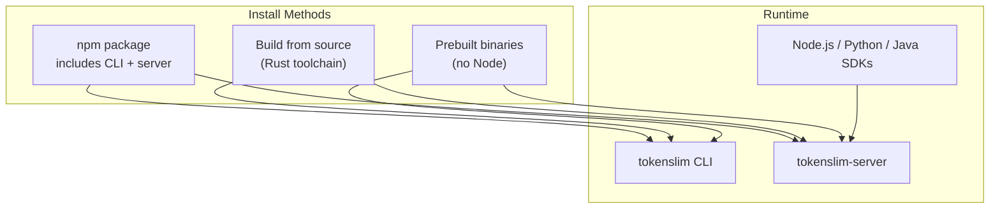
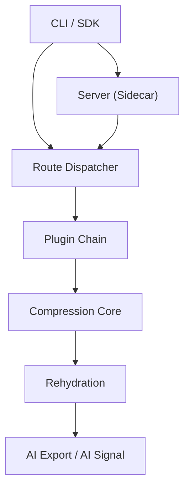
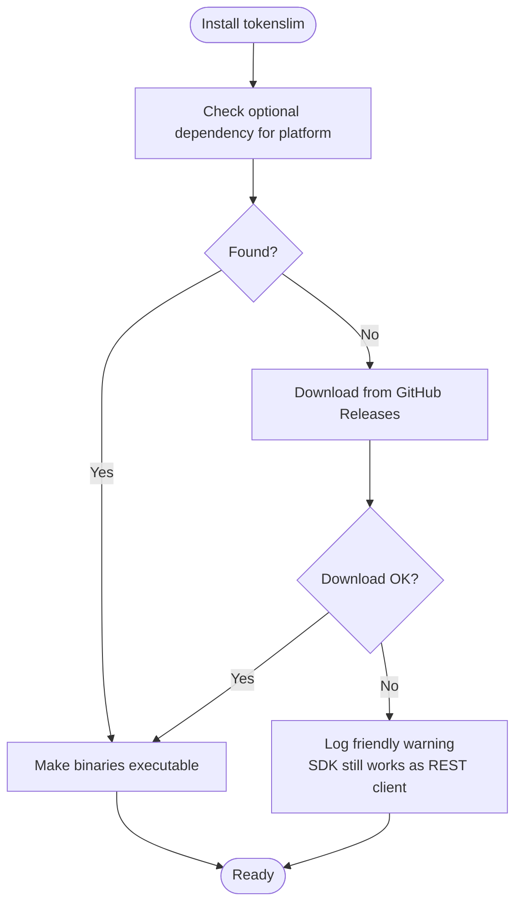
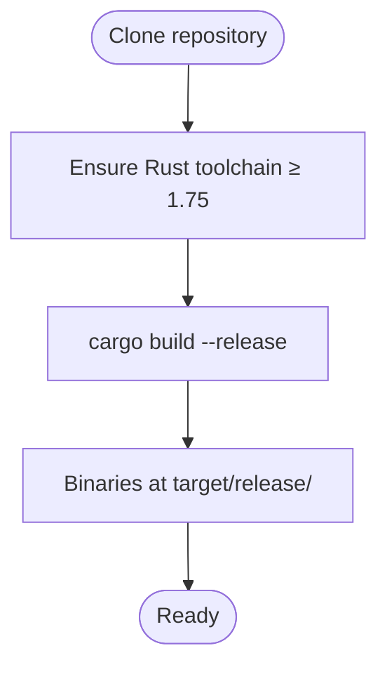
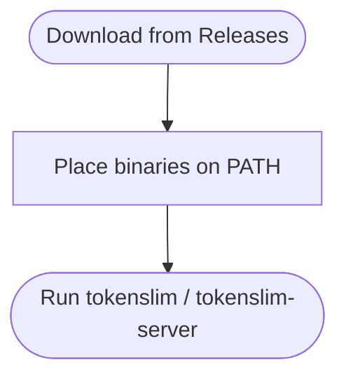
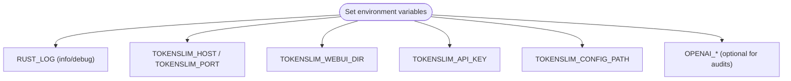
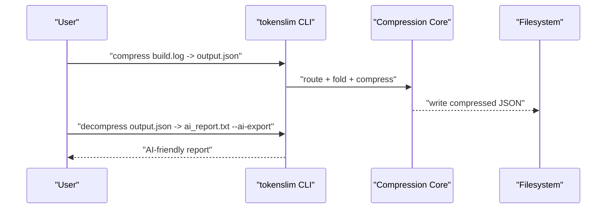
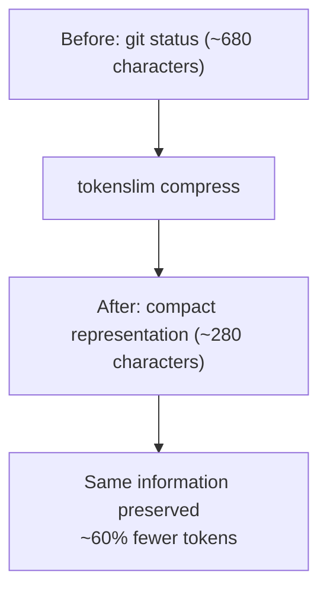
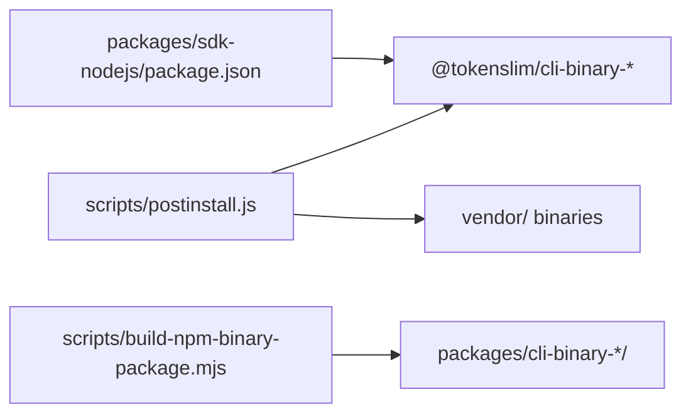

<!--
本文件由 AI 工具自动迁移自 .qoder/repowiki/, 用于补充 docs/ 的视角。
- 生成器: Qoder (阿里云 AI IDE)
- 生成日期: 2026-06-23
- 原文件: .qoder/repowiki/en/content/Getting Started.md
- 适用版本: TokenSlim v0.3.5 (扫描基线: C:\git_work\TokenSlim-publish2 当时快照)
- 维护说明: 内容已与项目 docs/ 现有文件去重; 若代码变更需人工校对。
-->

# Getting Started

<cite>
**Referenced Files in This Document**
- [README.md](file://README.md)
- [Cargo.toml](file://Cargo.toml)
- [src/main.rs](file://src/main.rs)
- [packages/sdk-nodejs/package.json](file://packages/sdk-nodejs/package.json)
- [packages/sdk-nodejs/scripts/postinstall.js](file://packages/sdk-nodejs/scripts/postinstall.js)
- [packages/cli-binary-darwin-x64/package.json](file://packages/cli-binary-darwin-x64/package.json)
- [scripts/build-npm-binary-package.mjs](file://scripts/build-npm-binary-package.mjs)
</cite>

## Table of Contents
1. [Introduction](#introduction)
2. [Project Structure](#project-structure)
3. [Core Components](#core-components)
4. [Architecture Overview](#architecture-overview)
5. [Detailed Component Analysis](#detailed-component-analysis)
6. [Dependency Analysis](#dependency-analysis)
7. [Performance Considerations](#performance-considerations)
8. [Troubleshooting Guide](#troubleshooting-guide)
9. [Conclusion](#conclusion)
10. [Appendices](#appendices)

## Introduction
TokenSlim is a high-performance, plugin-based text compression engine written in Rust. Its primary goal is to dramatically reduce the token cost of LLM inputs by intelligently compressing repetitive, structured logs (build logs, CI/CD outputs, web access logs, cloud logs, VCS output, stack traces, etc.) without losing diagnostic signals needed by AI models. It ships with:
- A CLI for scriptable batch processing
- A long-lived REST server (sidecar) for integration
- SDKs for Node.js, Python, and Java
- A rich plugin ecosystem (60+) covering common LLM input sources

## Project Structure
This getting started guide focuses on installation and quick start usage. The repository includes:
- CLI and server binaries (Rust)
- Platform-specific prebuilt binary packages for npm
- Post-installation logic to fetch binaries when optional packages are missing
- Example usage and environment variable configuration guidance

**Section sources**
- [README.md:188-236](file://README.md#L188-L236)
- [Cargo.toml:89-96](file://Cargo.toml#L89-L96)

## Core Components
- CLI: Command-line interface for compression, decompression, diagnostics, and plugin inspection.
- Sidecar server: Long-lived REST API server with an embedded Web UI for interactive compression and live log tailing.
- SDKs: JavaScript/TypeScript, Python, and Java clients for programmatic integration.
- Plugins: Over 60 data-driven plugins that route and transform input types into compressed form.

Key runtime configuration is controlled via environment variables (e.g., logging, server binding, API key, and optional LLM audit keys).

**Section sources**
- [README.md:238-356](file://README.md#L238-L356)
- [src/main.rs:1-42](file://src/main.rs#L1-L42)

## Architecture Overview
TokenSlim’s runtime is composed of:
- Route dispatcher selecting appropriate plugins
- Plugin chain performing extraction, folding, and semantic substitution
- Compression core building dictionaries and deduplicating
- Rehydration for round-trip safety
- AI Export/Semantic modes for LLM-friendly outputs

**Section sources**
- [README.md:382-392](file://README.md#L382-L392)

## Detailed Component Analysis

### Installation Methods

#### 1) Install via npm (recommended)
- Installs the Node.js SDK and optionally downloads platform-specific CLI binaries.
- npm/pnpm/yarn automatically picks the correct optional dependency matching your OS and CPU.
- If the optional package is unavailable, the postinstall script attempts to download a matching tarball from GitHub Releases; if that also fails, installation still succeeds but CLI commands are unavailable (SDK remains usable).

**Diagram sources**
- [packages/sdk-nodejs/scripts/postinstall.js:158-194](file://packages/sdk-nodejs/scripts/postinstall.js#L158-L194)
- [packages/sdk-nodejs/package.json:50-57](file://packages/sdk-nodejs/package.json#L50-L57)

**Section sources**
- [README.md:190-203](file://README.md#L190-L203)
- [packages/sdk-nodejs/package.json:50-57](file://packages/sdk-nodejs/package.json#L50-L57)
- [packages/sdk-nodejs/scripts/postinstall.js:158-194](file://packages/sdk-nodejs/scripts/postinstall.js#L158-L194)

#### 2) Build from source (Rust toolchain)
- Clone the repository and build the release binaries.
- The CLI and server binaries are placed under target/release (or target/release.exe on Windows).

**Diagram sources**
- [README.md:204-212](file://README.md#L204-L212)

**Section sources**
- [README.md:204-212](file://README.md#L204-L212)

#### 3) Prebuilt binaries (no Node)
- Download both tokenslim and tokenslim-server from the Releases page.
- Place them on PATH or reference them directly.

**Diagram sources**
- [README.md:214-216](file://README.md#L214-L216)

**Section sources**
- [README.md:214-216](file://README.md#L214-L216)

### Configuration Setup
- All runtime configuration is done via environment variables.
- Copy the example template to .env and adjust as needed.
- RUST_LOG controls logging verbosity; OPENAI_* variables are only needed for LLM-audit scripts.

**Section sources**
- [README.md:218-223](file://README.md#L218-L223)

### Quick Start Examples

#### Basic CLI usage
- Compress a build log and reorder interleaved output for deterministic error stacks.
- Decompress to an AI-friendly export or a high-signal lossy mode.

**Diagram sources**
- [README.md:242-270](file://README.md#L242-L270)

**Section sources**
- [README.md:242-270](file://README.md#L242-L270)

#### First compression example: before/after and token savings
- The README demonstrates a git status example showing significant token reduction while preserving all information.
- Use tokenslim gain to track cumulative savings over time.

**Section sources**
- [README.md:107-146](file://README.md#L107-L146)

### Initial Verification Steps
- Verify CLI availability after installation:
  - npm method: confirm tokenslim and tokenslim-server are on PATH
  - source/binary method: ensure binaries are built/executable
- Run a simple compression to validate:
  - tokenslim -i <input> -o <output>.json --reorder
  - tokenslim decompress -i <output>.json -o result.txt --ai-export
- Start the sidecar server and open the embedded Web UI:
  - tokenslim-server
  - Open http://127.0.0.1:10086/

**Section sources**
- [README.md:242-304](file://README.md#L242-L304)

## Dependency Analysis
- The Node.js SDK declares optional dependencies for each platform’s CLI binaries. The postinstall script detects the presence of the platform package and either chmods existing binaries or downloads them from GitHub Releases.
- The build pipeline stages platform-specific binaries and config into per-platform npm packages and then packs them.

**Diagram sources**
- [packages/sdk-nodejs/package.json:50-57](file://packages/sdk-nodejs/package.json#L50-L57)
- [packages/sdk-nodejs/scripts/postinstall.js:158-194](file://packages/sdk-nodejs/scripts/postinstall.js#L158-L194)
- [scripts/build-npm-binary-package.mjs:36-44](file://scripts/build-npm-binary-package.mjs#L36-L44)

**Section sources**
- [packages/sdk-nodejs/package.json:50-57](file://packages/sdk-nodejs/package.json#L50-L57)
- [packages/sdk-nodejs/scripts/postinstall.js:158-194](file://packages/sdk-nodejs/scripts/postinstall.js#L158-L194)
- [scripts/build-npm-binary-package.mjs:36-44](file://scripts/build-npm-binary-package.mjs#L36-L44)

## Performance Considerations
- Zero-copy pipeline, parallel block processing, and deterministic global reordering enable high throughput and consistent results.
- Use the sidecar server for low-latency, repeated compression tasks and to leverage the embedded Web UI for interactive workflows.

[No sources needed since this section provides general guidance]

## Troubleshooting Guide
- npm install completes but CLI commands are unavailable:
  - The postinstall script attempted to download from GitHub Releases and failed; the SDK still works as a REST client.
  - Resolution: install the platform-specific optional dependency or use prebuilt binaries.
- Windows-specific permissions:
  - Optional binaries are not marked executable; the postinstall script skips chmod on Windows.
- Logging and diagnostics:
  - Set RUST_LOG to control verbosity; use tokenslim workspace and tokenslim encoding for environment diagnostics.

**Section sources**
- [packages/sdk-nodejs/scripts/postinstall.js:158-194](file://packages/sdk-nodejs/scripts/postinstall.js#L158-L194)
- [src/main.rs:9-28](file://src/main.rs#L9-L28)
- [README.md:218-223](file://README.md#L218-L223)

## Conclusion
You now have multiple installation options to get started quickly:
- npm for a turnkey experience with automatic platform detection
- Building from source for full control
- Prebuilt binaries for environments without Node

Use the quick start examples to validate your installation, explore the sidecar server, and begin compressing repetitive logs to achieve 50–95% token savings.

[No sources needed since this section summarizes without analyzing specific files]

## Appendices
- Additional resources:
  - 5-minute Quickstart
  - Full SDK usage guide
  - User guide

**Section sources**
- [README.md:236](file://README.md#L236)
---

<!--
来源: en/content/Getting Started.md  |  生成器: Qoder (阿里云 AI IDE)  |  扫描基线: publish2 @ 2026-06-23
-->
