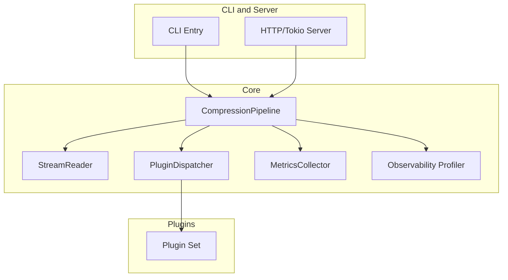
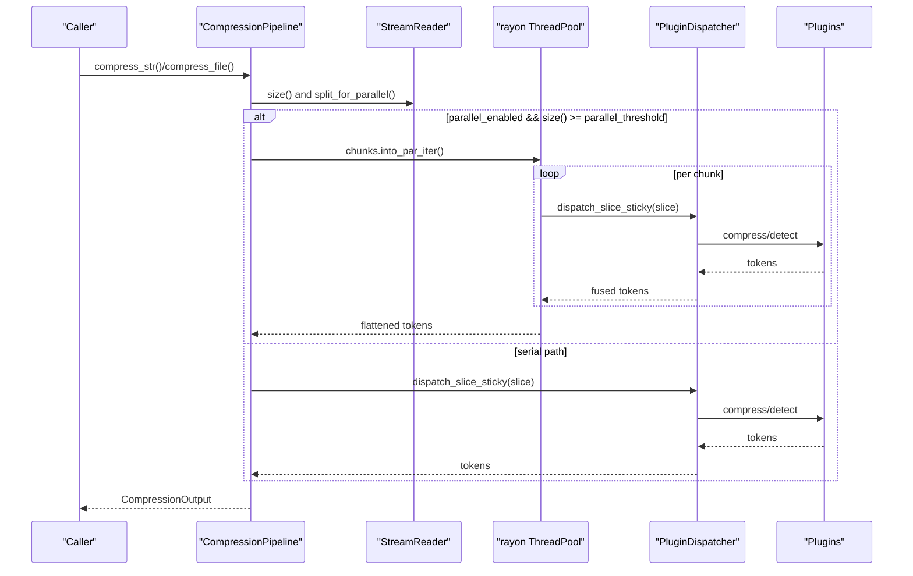
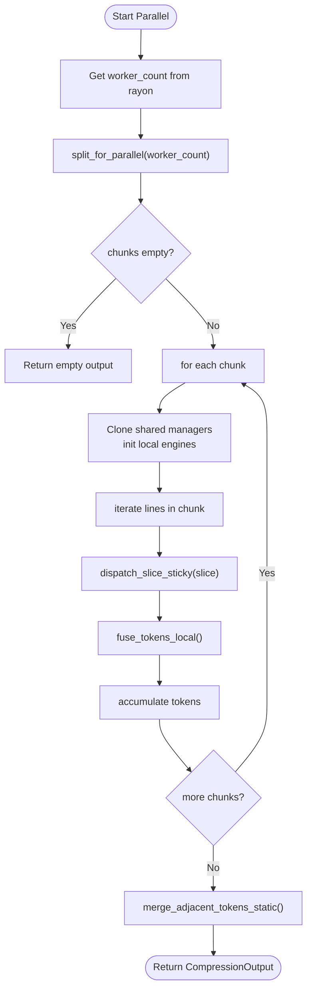
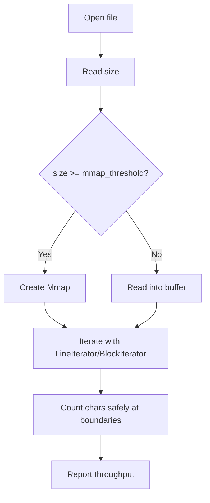
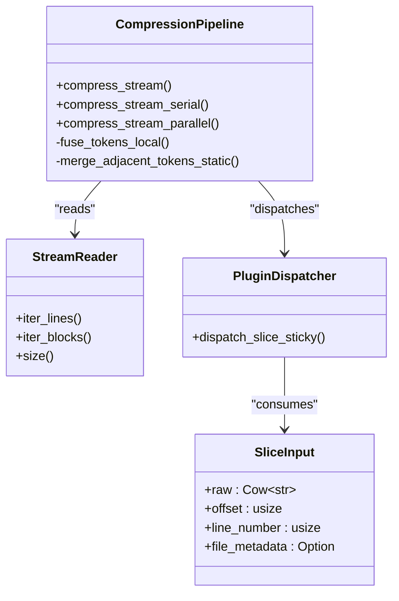
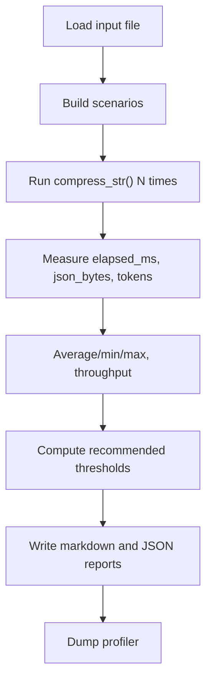
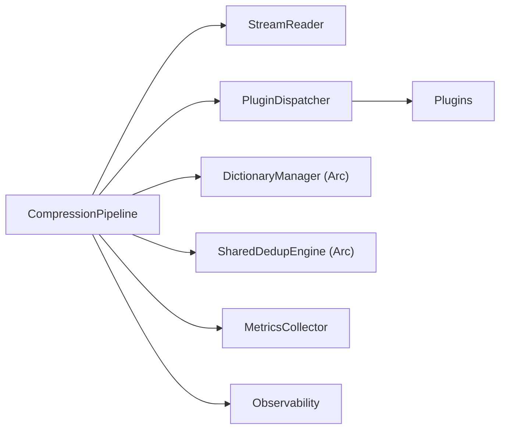

<!--
本文件由 AI 工具自动迁移自 .qoder/repowiki/, 用于补充 docs/ 的视角。
- 生成器: Qoder (阿里云 AI IDE)
- 生成日期: 2026-06-23
- 原文件: .qoder/repowiki/en/content/Performance and Optimization.md
- 适用版本: TokenSlim v0.3.5 (扫描基线: C:\git_work\TokenSlim-publish2 当时快照)
- 维护说明: 内容已与项目 docs/ 现有文件去重; 若代码变更需人工校对。
-->

# Performance and Optimization

<cite>
**Referenced Files in This Document**
- [compression_pipeline/methods.rs](file://src/core/compression_pipeline/methods.rs)
- [stream_reader/types.rs](file://src/core/stream_reader/types.rs)
- [pipeline_bench.rs](file://src/bin/pipeline_bench.rs)
- [test_parallel_read.rs](file://tests/test_parallel_read.rs)
- [observability.rs](file://src/core/observability.rs)
- [compression_pipeline.md](file://docs/design/compression_pipeline.md)
- [metrics.md](file://docs/design/metrics.md)
- [tokenslim-server.rs](file://src/bin/tokenslim-server.rs)
- [plugin_dispatcher/mod.rs](file://src/core/plugin_dispatcher/mod.rs)
</cite>

## Table of Contents
1. [Introduction](#introduction)
2. [Project Structure](#project-structure)
3. [Core Components](#core-components)
4. [Architecture Overview](#architecture-overview)
5. [Detailed Component Analysis](#detailed-component-analysis)
6. [Dependency Analysis](#dependency-analysis)
7. [Performance Considerations](#performance-considerations)
8. [Troubleshooting Guide](#troubleshooting-guide)
9. [Conclusion](#conclusion)
10. [Appendices](#appendices)

## Introduction
This document provides comprehensive performance optimization guidance for TokenSlim. It synthesizes benchmark-driven insights, parallel processing architecture leveraging rayon, memory-mapped IO for large files, zero-copy pipeline design, and streaming compression techniques. It also covers memory usage patterns, GC impact, resource utilization strategies, tuning guidelines for CLI, server, and IDE integrations, scaling considerations, profiling and bottleneck identification, and production monitoring.

## Project Structure
TokenSlim’s performance-critical components are centered around the compression pipeline, streaming reader, plugin dispatcher, and observability/metrics subsystems. Benchmarks and tests validate parallel IO, memory mapping, and throughput characteristics.

**Diagram sources**
- [compression_pipeline/methods.rs:32-62](file://src/core/compression_pipeline/methods.rs#L32-L62)
- [stream_reader/types.rs:186-196](file://src/core/stream_reader/types.rs#L186-L196)
- [plugin_dispatcher/mod.rs:13-15](file://src/core/plugin_dispatcher/mod.rs#L13-L15)
- [observability.rs:1-37](file://src/core/observability.rs#L1-L37)

**Section sources**
- [compression_pipeline/methods.rs:32-62](file://src/core/compression_pipeline/methods.rs#L32-L62)
- [stream_reader/types.rs:186-196](file://src/core/stream_reader/types.rs#L186-L196)
- [plugin_dispatcher/mod.rs:13-15](file://src/core/plugin_dispatcher/mod.rs#L13-L15)
- [compression_pipeline.md:89-151](file://docs/design/compression_pipeline.md#L89-L151)

## Core Components
- CompressionPipeline: orchestrates serial and parallel compression paths, manages chunk splitting, dispatches slices to plugins, merges tokens, and records metrics.
- StreamReader: provides streaming access to text/binary data with optional memory mapping and line/block iteration.
- PluginDispatcher: executes plugin detection/compression logic with sticky dispatch and error isolation.
- Observability/Metrics: collects timing, plugin stats, and emits profiles and logs for profiling and monitoring.

Key performance-relevant APIs and thresholds:
- Parallel threshold and stream mmap threshold selection via pipeline configuration.
- Worker count derived from rayon runtime for parallel chunking.
- Token fusion and merging reduce allocations and improve cache locality.

**Section sources**
- [compression_pipeline/methods.rs:77-94](file://src/core/compression_pipeline/methods.rs#L77-L94)
- [compression_pipeline/methods.rs:253-435](file://src/core/compression_pipeline/methods.rs#L253-L435)
- [compression_pipeline/methods.rs:437-481](file://src/core/compression_pipeline/methods.rs#L437-L481)
- [stream_reader/types.rs:361-377](file://src/core/stream_reader/types.rs#L361-L377)
- [observability.rs:1-37](file://src/core/observability.rs#L1-L37)
- [metrics.md:1-9](file://docs/design/metrics.md#L1-L9)

## Architecture Overview
The pipeline supports two primary modes:
- Serial path: single-threaded processing with optional log reordering and line-mode tokenization.
- Parallel path: chunk-based processing using rayon with per-chunk engines and shared deduplication.

Memory mapping is applied when input size exceeds a configurable threshold, enabling efficient large-file IO.

**Diagram sources**
- [compression_pipeline/methods.rs:77-94](file://src/core/compression_pipeline/methods.rs#L77-L94)
- [compression_pipeline/methods.rs:253-435](file://src/core/compression_pipeline/methods.rs#L253-L435)
- [compression_pipeline/methods.rs:483-498](file://src/core/compression_pipeline/methods.rs#L483-L498)
- [plugin_dispatcher/mod.rs:13-15](file://src/core/plugin_dispatcher/mod.rs#L13-L15)

## Detailed Component Analysis

### Parallel Processing Architecture (rayon)
- Chunking: input is split into chunks sized to worker count; each chunk is processed independently.
- Per-chunk engines: each worker initializes local DictionaryEngine, DedupEngine, TextSlicer, and ContentAnalyzer to minimize contention.
- Sticky dispatch: maintains plugin context across slices for consistent behavior.
- Token fusion: local fusion reduces adjacent Text tokens; global merge ensures correctness after concatenation.

**Diagram sources**
- [compression_pipeline/methods.rs:253-435](file://src/core/compression_pipeline/methods.rs#L253-L435)
- [compression_pipeline/methods.rs:437-481](file://src/core/compression_pipeline/methods.rs#L437-L481)

**Section sources**
- [compression_pipeline/methods.rs:253-435](file://src/core/compression_pipeline/methods.rs#L253-L435)
- [compression_pipeline/methods.rs:437-481](file://src/core/compression_pipeline/methods.rs#L437-L481)

### Memory Mapping and Streaming IO
- Stream thresholds: configurable mmap threshold determines whether to use memory mapping for large streams.
- Line/block iterators: UTF-8 boundary-aware iteration avoids invalid decoding and supports both line-oriented and block-oriented processing.
- Parallel mmap read test: validates chunked, UTF-8-safe parallel scanning with measurable throughput gains.

**Diagram sources**
- [stream_reader/types.rs:186-196](file://src/core/stream_reader/types.rs#L186-L196)
- [stream_reader/types.rs:198-282](file://src/core/stream_reader/types.rs#L198-L282)
- [stream_reader/types.rs:284-334](file://src/core/stream_reader/types.rs#L284-L334)
- [test_parallel_read.rs:1-112](file://tests/test_parallel_read.rs#L1-L112)

**Section sources**
- [stream_reader/types.rs:361-377](file://src/core/stream_reader/types.rs#L361-L377)
- [stream_reader/types.rs:198-282](file://src/core/stream_reader/types.rs#L198-L282)
- [stream_reader/types.rs:284-334](file://src/core/stream_reader/types.rs#L284-L334)
- [test_parallel_read.rs:1-112](file://tests/test_parallel_read.rs#L1-L112)

### Zero-Copy Pipeline and Streaming Compression
- Borrowed strings: SliceInput carries Cow<str> to avoid unnecessary cloning during slicing and dispatch.
- Arena allocation: Bump arenas allocate short-lived strings and slices, reducing heap traffic.
- Token fusion: local fusion coalesces adjacent Text tokens to minimize allocations and improve serialization throughput.

**Diagram sources**
- [stream_reader/types.rs:177-184](file://src/core/stream_reader/types.rs#L177-L184)
- [compression_pipeline/methods.rs:96-251](file://src/core/compression_pipeline/methods.rs#L96-L251)
- [compression_pipeline/methods.rs:253-435](file://src/core/compression_pipeline/methods.rs#L253-L435)
- [compression_pipeline/methods.rs:437-481](file://src/core/compression_pipeline/methods.rs#L437-L481)
- [plugin_dispatcher/mod.rs:13-15](file://src/core/plugin_dispatcher/mod.rs#L13-L15)

**Section sources**
- [stream_reader/types.rs:177-184](file://src/core/stream_reader/types.rs#L177-L184)
- [compression_pipeline/methods.rs:96-251](file://src/core/compression_pipeline/methods.rs#L96-L251)
- [compression_pipeline/methods.rs:253-435](file://src/core/compression_pipeline/methods.rs#L253-L435)
- [compression_pipeline/methods.rs:437-481](file://src/core/compression_pipeline/methods.rs#L437-L481)

### Benchmark Methodology and Results
- Scenarios: mmap+parallel, mmap+serial, non_mmap+parallel, non_mmap+serial.
- Metrics: elapsed time, throughput MB/s, JSON output size, token ratio (via tokenizer).
- Recommendations: automatic thresholds computed by comparing best serial vs. best parallel and mmap vs. non-mmap configurations.

**Diagram sources**
- [pipeline_bench.rs:131-399](file://src/bin/pipeline_bench.rs#L131-L399)

**Section sources**
- [pipeline_bench.rs:162-183](file://src/bin/pipeline_bench.rs#L162-L183)
- [pipeline_bench.rs:202-272](file://src/bin/pipeline_bench.rs#L202-L272)
- [pipeline_bench.rs:274-313](file://src/bin/pipeline_bench.rs#L274-L313)
- [pipeline_bench.rs:315-399](file://src/bin/pipeline_bench.rs#L315-L399)

## Dependency Analysis
- CompressionPipeline depends on StreamReader for input, PluginDispatcher for plugin execution, and shared engines (DictionaryManager, SharedDedupEngine).
- Parallel path isolates per-worker engines to reduce contention; shared dedup caches are coordinated across workers.
- Metrics and observability integrate at module boundaries and plugin dispatch stages.

**Diagram sources**
- [compression_pipeline/methods.rs:32-62](file://src/core/compression_pipeline/methods.rs#L32-L62)
- [compression_pipeline/methods.rs:275-279](file://src/core/compression_pipeline/methods.rs#L275-L279)
- [plugin_dispatcher/mod.rs:13-15](file://src/core/plugin_dispatcher/mod.rs#L13-L15)

**Section sources**
- [compression_pipeline/methods.rs:32-62](file://src/core/compression_pipeline/methods.rs#L32-L62)
- [compression_pipeline/methods.rs:275-279](file://src/core/compression_pipeline/methods.rs#L275-L279)

## Performance Considerations

### Throughput and Scaling
- Parallel threshold: choose a threshold that favors parallel processing for larger inputs; the benchmark tool computes a recommendation based on measured serial vs. parallel performance.
- Stream mmap threshold: select a threshold that enables memory mapping for large files to reduce syscall overhead and improve IO bandwidth.
- Worker sizing: rayon worker count drives chunk granularity; ensure CPU cores align with workload concurrency.

Practical guidance:
- CLI: increase parallel threshold for large log files; enable mmap for files > 1–10 MB depending on platform and storage.
- Server: tune thresholds per deployment profile; consider dynamic adjustment based on observed input sizes.
- IDE integration: prefer serial path for small files (< threshold) to avoid startup overhead; enable parallel path for large diagnostics.

**Section sources**
- [pipeline_bench.rs:274-313](file://src/bin/pipeline_bench.rs#L274-L313)
- [compression_pipeline/methods.rs:85-90](file://src/core/compression_pipeline/methods.rs#L85-L90)
- [stream_reader/types.rs:361-377](file://src/core/stream_reader/types.rs#L361-L377)

### Memory Usage Patterns and GC Impact
- Zero-copy and arenas: SliceInput and Bump-backed allocations minimize allocations and GC pressure.
- Token fusion: reduces intermediate allocations by coalescing adjacent Text tokens.
- Shared engines: DictionaryManager and SharedDedupEngine are Arc’ed to avoid duplication across workers.

Recommendations:
- Prefer line-mode tokenization for structured logs to reduce intermediate buffers.
- Monitor memory deltas via observability scopes to detect regressions.
- Keep plugin workloads deterministic to maximize cross-slice deduplication effectiveness.

**Section sources**
- [stream_reader/types.rs:177-184](file://src/core/stream_reader/types.rs#L177-L184)
- [compression_pipeline/methods.rs:437-481](file://src/core/compression_pipeline/methods.rs#L437-L481)
- [compression_pipeline/methods.rs:288-305](file://src/core/compression_pipeline/methods.rs#L288-L305)

### Resource Utilization Strategies
- CPU: parallel path scales with rayon threads; ensure adequate worker count for multi-core systems.
- IO: mmap improves throughput for large files; line/block iterators prevent partial UTF-8 reads.
- Memory: limit per-worker buffers; reuse arenas; avoid unnecessary string copies.

**Section sources**
- [compression_pipeline/methods.rs:259-260](file://src/core/compression_pipeline/methods.rs#L259-L260)
- [stream_reader/types.rs:217-228](file://src/core/stream_reader/types.rs#L217-L228)
- [stream_reader/types.rs:306-316](file://src/core/stream_reader/types.rs#L306-L316)

### Deployment Tuning Guidelines
- CLI:
  - Large files: enable parallel path and mmap; adjust thresholds based on benchmark results.
  - Small files: serial path often sufficient; avoid parallel overhead.
- Server:
  - Use spawn_blocking for CPU-bound compression; track throughput and latency.
  - Expose metrics and profiling dumps for operational visibility.
- IDE integration:
  - Batch processing: enable parallel path for multi-file sessions.
  - Real-time: prefer serial path for responsiveness; cache results when appropriate.

**Section sources**
- [tokenslim-server.rs:868-894](file://src/bin/tokenslim-server.rs#L868-L894)
- [tokenslim-server.rs:896-913](file://src/bin/tokenslim-server.rs#L896-L913)
- [pipeline_bench.rs:274-313](file://src/bin/pipeline_bench.rs#L274-L313)

### Capacity Planning and Monitoring
- Metrics: track input/output sizes, slice counts, module timings, plugin stats, and error rates.
- Observability: use ScopeProbe to measure elapsed time and memory delta per operation; dump global profiler periodically.
- Alerts: monitor throughput drops, increased latency, and error spikes.

**Section sources**
- [metrics.md:1-9](file://docs/design/metrics.md#L1-L9)
- [observability.rs:73-140](file://src/core/observability.rs#L73-L140)

## Troubleshooting Guide

### Profiling and Bottleneck Identification
- Enable profiler dumps to identify hotspots by name and average durations.
- Use ScopeProbe to bracket expensive sections and correlate memory availability changes.
- Review plugin stats and error logs to locate degraded parse tiers or plugin failures.

**Section sources**
- [observability.rs:19-37](file://src/core/observability.rs#L19-L37)
- [compression_pipeline/methods.rs:504-583](file://src/core/compression_pipeline/methods.rs#L504-L583)

### Common Issues and Fixes
- Slow parallel path: verify worker count and chunk sizes; ensure parallel threshold is set appropriately.
- High memory usage: confirm token fusion and arena usage; check for excessive dictionary growth.
- IO bottlenecks: enable mmap for large files; validate UTF-8 boundary handling in iterators.

**Section sources**
- [compression_pipeline/methods.rs:253-435](file://src/core/compression_pipeline/methods.rs#L253-L435)
- [stream_reader/types.rs:217-228](file://src/core/stream_reader/types.rs#L217-L228)
- [stream_reader/types.rs:306-316](file://src/core/stream_reader/types.rs#L306-L316)

## Conclusion
TokenSlim’s performance hinges on judicious use of parallel processing, memory mapping, zero-copy pipelines, and careful resource management. Benchmarks inform threshold selection, while observability and metrics provide ongoing insight. By tuning thresholds per deployment scenario and monitoring key metrics, teams can achieve predictable throughput and low-latency compression across CLI, servers, and IDE integrations.

## Appendices

### Benchmark Report Generation
- Scenarios and metrics are computed and summarized into markdown and JSON artifacts.
- Recommended thresholds are derived by comparing best serial vs. parallel and mmap vs. non-mmap runs.

**Section sources**
- [pipeline_bench.rs:162-183](file://src/bin/pipeline_bench.rs#L162-L183)
- [pipeline_bench.rs:202-272](file://src/bin/pipeline_bench.rs#L202-L272)
- [pipeline_bench.rs:315-399](file://src/bin/pipeline_bench.rs#L315-L399)
---

<!--
来源: en/content/Performance and Optimization.md  |  生成器: Qoder (阿里云 AI IDE)  |  扫描基线: publish2 @ 2026-06-23
-->
