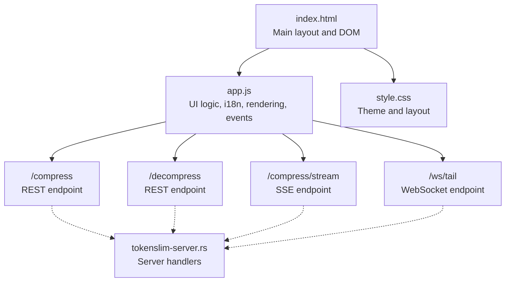
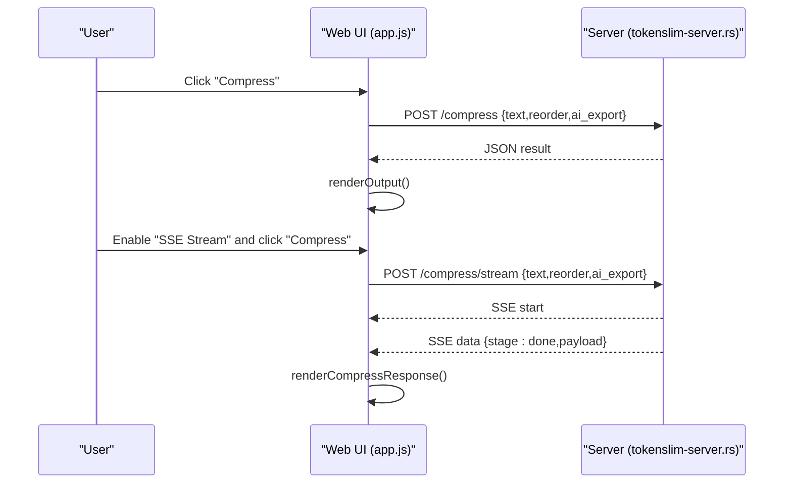
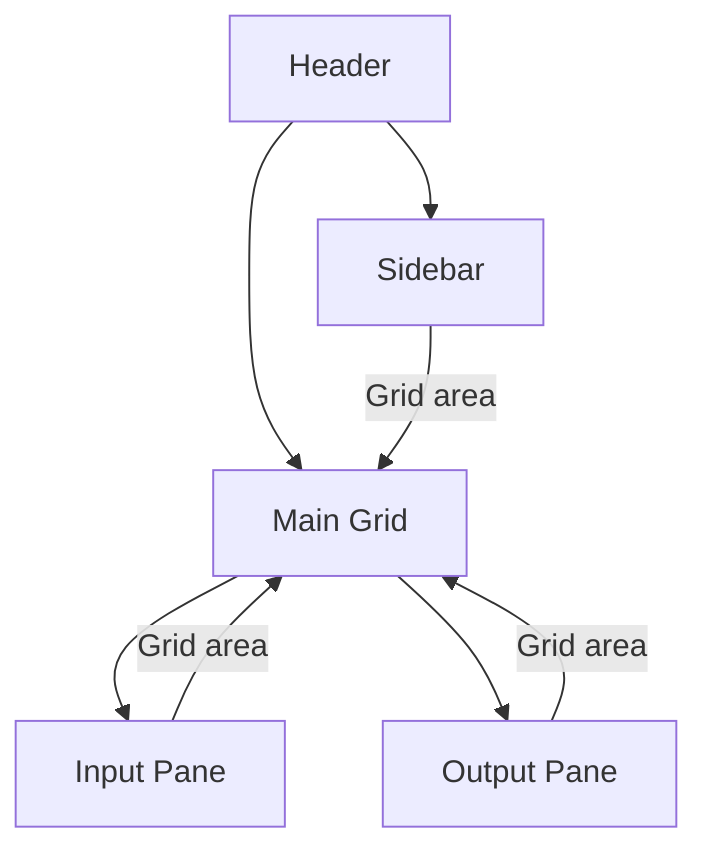
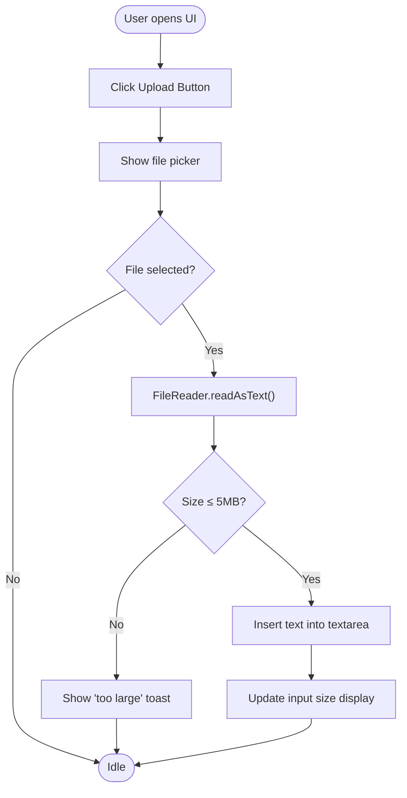
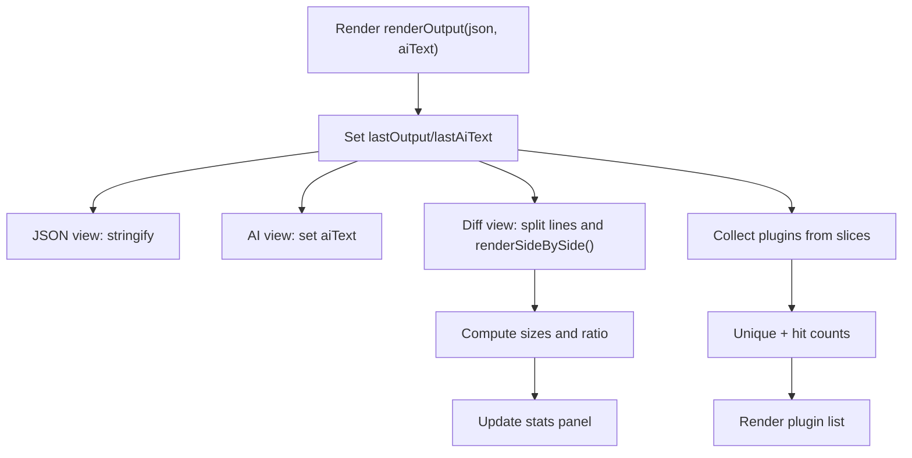
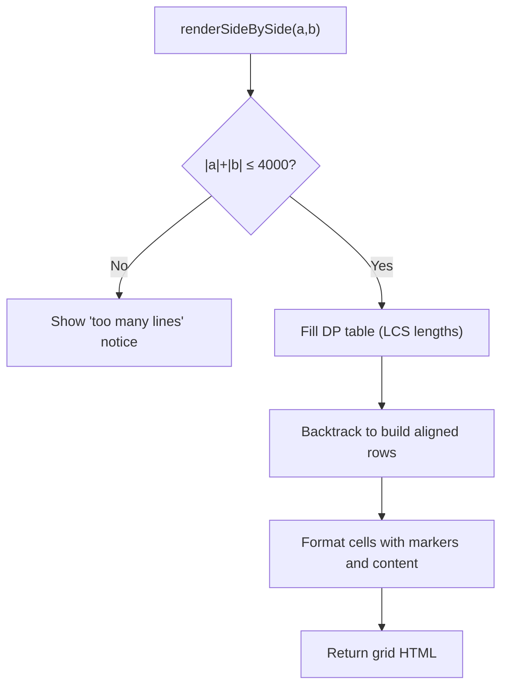
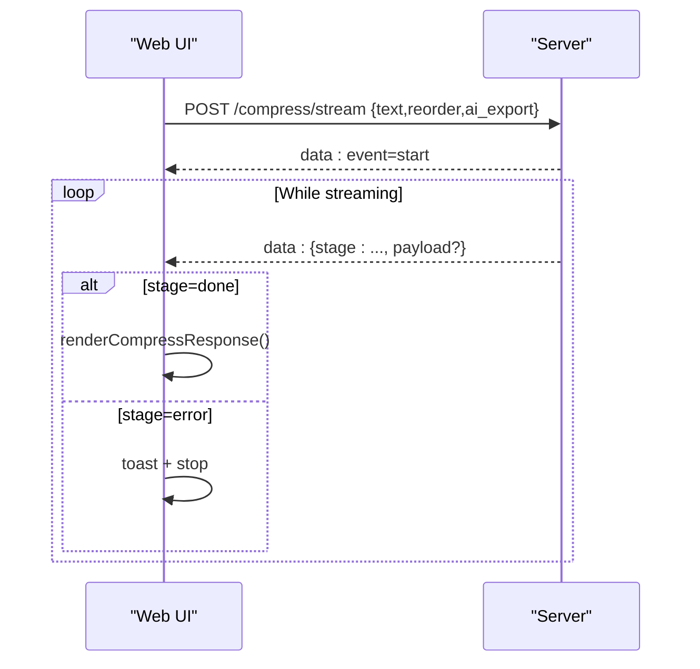
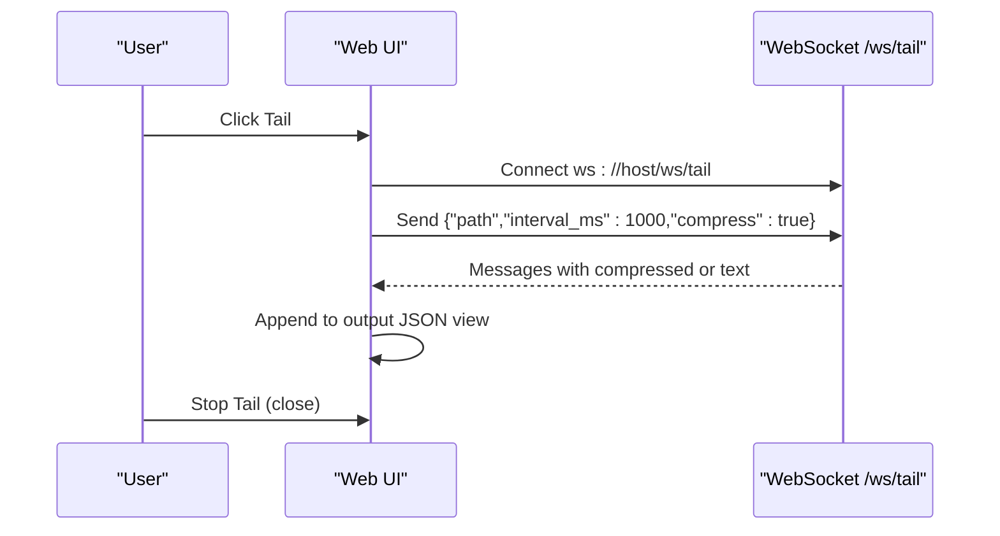
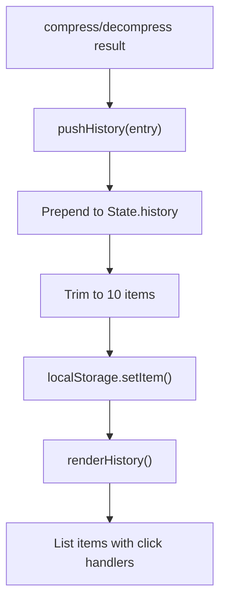
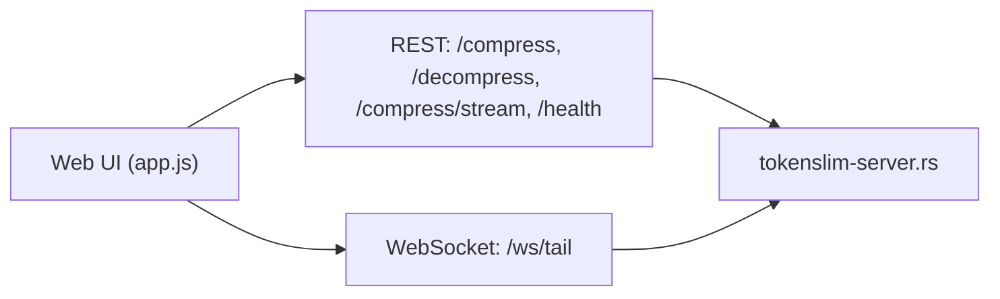

<!--
本文件由 AI 工具自动迁移自 .qoder/repowiki/, 用于补充 docs/ 的视角。
- 生成器: Qoder (阿里云 AI IDE)
- 生成日期: 2026-06-23
- 原文件: .qoder/repowiki/en/content/Web UI Interface/Interface Overview and Features.md
- 适用版本: TokenSlim v0.3.5 (扫描基线: C:\git_work\TokenSlim-publish2 当时快照)
- 维护说明: 内容已与项目 docs/ 现有文件去重; 若代码变更需人工校对。
-->

# Interface Overview and Features

<cite>
**Referenced Files in This Document**
- [index.html](file://webui/index.html)
- [app.js](file://webui/assets/app.js)
- [style.css](file://webui/assets/style.css)
- [tokenslim-server.rs](file://src/bin/tokenslim-server.rs)
- [README.md](file://README.md)
- [capture_webui.py](file://docs/audit/capture_webui.py)
</cite>

## Table of Contents
1. [Introduction](#introduction)
2. [Project Structure](#project-structure)
3. [Core Components](#core-components)
4. [Architecture Overview](#architecture-overview)
5. [Detailed Component Analysis](#detailed-component-analysis)
6. [Dependency Analysis](#dependency-analysis)
7. [Performance Considerations](#performance-considerations)
8. [Troubleshooting Guide](#troubleshooting-guide)
9. [Conclusion](#conclusion)
10. [Appendices](#appendices)

## Introduction
This document describes the TokenSlim Web UI single-page application (SPA) that provides an interactive interface for log and text compression, real-time streaming, side-by-side diff visualization, and AI export. The UI is implemented as a zero-dependency vanilla JavaScript application with embedded static assets compiled into the server binary. It supports drag-and-drop file uploads, live WebSocket tailing, and three output views: JSON, side-by-side diff, and AI export.

## Project Structure
The Web UI consists of:
- A minimal HTML skeleton with two main panes (input and output), a sidebar, and a toast notification.
- A single JavaScript module implementing all UI logic, internationalization, rendering, and API/WebSocket interactions.
- A compact CSS theme with dark mode and responsive grid layout.

**Diagram sources**
- [index.html:1-100](file://webui/index.html#L1-L100)
- [app.js:1-544](file://webui/assets/app.js#L1-L544)
- [tokenslim-server.rs:135-142](file://src/bin/tokenslim-server.rs#L135-L142)
- [tokenslim-server.rs:854-851](file://src/bin/tokenslim-server.rs#L854-L851)
- [tokenslim-server.rs:953-995](file://src/bin/tokenslim-server.rs#L953-L995)

**Section sources**
- [index.html:1-100](file://webui/index.html#L1-L100)
- [app.js:1-544](file://webui/assets/app.js#L1-L544)
- [style.css:1-451](file://webui/assets/style.css#L1-L451)
- [README.md:279-334](file://README.md#L279-L334)

## Core Components
- Input Pane
  - Drag-and-drop zone with overlay feedback.
  - Text area for pasted content.
  - Options: Enable reorder, AI export, SSE stream.
  - Controls: Upload file, Sample, Clear, Compress, Decompress, Tail.
- Output Pane
  - Three views: JSON, side-by-side diff, AI export.
  - Stats panel showing input/output sizes and compression ratio.
  - Actions: Copy, Download, Toggle view.
- Sidebar
  - History list (last few entries) with click-to-restore.
  - Plugin hits list showing matched plugin families and hit counts.
- Toast notifications for user feedback.

Key behaviors:
- File upload via input[type=file] or drag-and-drop.
- Real-time size display for input text.
- Streaming compression via SSE when enabled.
- Live log tailing via WebSocket with compression toggle.
- View switching among JSON, diff, and AI export.

**Section sources**
- [index.html:27-82](file://webui/index.html#L27-L82)
- [index.html:84-93](file://webui/index.html#L84-L93)
- [app.js:126-151](file://webui/assets/app.js#L126-L151)
- [app.js:176-183](file://webui/assets/app.js#L176-L183)
- [app.js:185-218](file://webui/assets/app.js#L185-L218)
- [app.js:220-268](file://webui/assets/app.js#L220-L268)
- [app.js:322-374](file://webui/assets/app.js#L322-L374)
- [app.js:376-431](file://webui/assets/app.js#L376-L431)
- [app.js:433-449](file://webui/assets/app.js#L433-L449)
- [app.js:451-491](file://webui/assets/app.js#L451-L491)

## Architecture Overview
The Web UI is a thin client that communicates with the server via REST and SSE for compression, and WebSocket for live tailing. The server exposes:
- POST /compress: synchronous compression.
- POST /compress/stream: streaming compression via SSE.
- POST /decompress: reverse reconstruction.
- GET /health: server health/version/uptime.
- WebSocket /ws/tail: live log tailing with optional compression.

**Diagram sources**
- [app.js:336-361](file://webui/assets/app.js#L336-L361)
- [app.js:376-431](file://webui/assets/app.js#L376-L431)
- [tokenslim-server.rs:854-851](file://src/bin/tokenslim-server.rs#L854-L851)

## Detailed Component Analysis

### Layout and Grid System
- Body uses CSS Grid with three areas: header, main, and sidebar.
- Main area is a 2-column grid for input and output panes.
- Sidebar is a narrow column for history and plugin hits.

**Diagram sources**
- [style.css:25-96](file://webui/assets/style.css#L25-L96)

**Section sources**
- [style.css:25-96](file://webui/assets/style.css#L25-L96)

### Input Pane: Upload and Drag-and-Drop
- Hidden file input triggers on button click.
- Drag-and-drop listeners add visual overlay and read file via FileReader.
- File size limit enforced (5 MB).
- Input size display updates on text change and file load.

**Diagram sources**
- [app.js:126-151](file://webui/assets/app.js#L126-L151)
- [index.html:32-45](file://webui/index.html#L32-L45)

**Section sources**
- [index.html:32-45](file://webui/index.html#L32-L45)
- [app.js:126-151](file://webui/assets/app.js#L126-L151)

### Output Views and Rendering
- JSON view: formatted JSON of compression result.
- Side-by-side diff view: LCS-based alignment with +/- markers.
- AI export view: free-text AI-formatted output when available.
- Stats panel shows input size/lines, output size/lines, and compression ratio.
- Plugin hits list aggregates plugin names and occurrence counts.

**Diagram sources**
- [app.js:185-218](file://webui/assets/app.js#L185-L218)
- [app.js:220-268](file://webui/assets/app.js#L220-L268)

**Section sources**
- [app.js:185-218](file://webui/assets/app.js#L185-L218)
- [app.js:220-268](file://webui/assets/app.js#L220-L268)
- [style.css:253-347](file://webui/assets/style.css#L253-L347)

### Side-by-Side Diff Algorithm
- Uses LCS to compute differences between input and output lines.
- Applies a practical cap on total line count to avoid heavy computation.
- Renders aligned rows with colored cells for additions/deletions.

**Diagram sources**
- [app.js:244-268](file://webui/assets/app.js#L244-L268)

**Section sources**
- [app.js:244-268](file://webui/assets/app.js#L244-L268)

### Streaming Compression (SSE)
- When SSE stream is enabled, the UI posts to /compress/stream and reads chunks via fetch with a ReadableStream.
- Server sends events with stage=start/done/error and payload.
- On done, renders the final result; on error, shows toast and stops.

**Diagram sources**
- [app.js:376-431](file://webui/assets/app.js#L376-L431)
- [tokenslim-server.rs:854-851](file://src/bin/tokenslim-server.rs#L854-L851)

**Section sources**
- [app.js:376-431](file://webui/assets/app.js#L376-L431)
- [tokenslim-server.rs:854-851](file://src/bin/tokenslim-server.rs#L854-L851)

### Real-Time Tail (WebSocket)
- Clicking Tail opens a WebSocket connection to /ws/tail.
- Sends a JSON configuration with path, interval_ms, and compress flag.
- Receives streamed lines; if compressed=true, uses semantic_log or falls back to JSON; otherwise uses raw text.
- Supports toggling to stop tailing.

**Diagram sources**
- [app.js:451-491](file://webui/assets/app.js#L451-L491)
- [tokenslim-server.rs:953-995](file://src/bin/tokenslim-server.rs#L953-L995)

**Section sources**
- [app.js:451-491](file://webui/assets/app.js#L451-L491)
- [tokenslim-server.rs:953-995](file://src/bin/tokenslim-server.rs#L953-L995)

### History and Plugin Hits
- History stores last 10 entries with input/output sizes, ratio, and timestamp.
- Saved to localStorage; restored on load.
- Clicking a history item restores the input text.
- Plugin hits list shows unique plugin names and their counts from the compression result.

**Diagram sources**
- [app.js:272-320](file://webui/assets/app.js#L272-L320)
- [app.js:322-374](file://webui/assets/app.js#L322-L374)

**Section sources**
- [app.js:272-320](file://webui/assets/app.js#L272-L320)
- [app.js:322-374](file://webui/assets/app.js#L322-L374)

### Internationalization and Theme
- I18N keys for UI strings with zh-CN and en locales.
- Applies language to document element and updates text content of nodes with data-i18n attributes.
- Dark theme with accent colors and monospace fonts for code-like content.

**Section sources**
- [app.js:13-90](file://webui/assets/app.js#L13-L90)
- [app.js:105-112](file://webui/assets/app.js#L105-L112)
- [style.css:1-17](file://webui/assets/style.css#L1-L17)

## Dependency Analysis
- The Web UI depends on:
  - Local storage for history persistence.
  - Clipboard API for copy action.
  - Fetch API for REST endpoints.
  - ReadableStream/Fetch for SSE.
  - WebSocket for live tailing.
- Server endpoints:
  - /compress, /decompress, /compress/stream, /health, /ws/tail.

**Diagram sources**
- [app.js:322-374](file://webui/assets/app.js#L322-L374)
- [app.js:451-491](file://webui/assets/app.js#L451-L491)
- [tokenslim-server.rs:135-142](file://src/bin/tokenslim-server.rs#L135-L142)
- [tokenslim-server.rs:854-851](file://src/bin/tokenslim-server.rs#L854-L851)
- [tokenslim-server.rs:953-995](file://src/bin/tokenslim-server.rs#L953-L995)

**Section sources**
- [app.js:322-374](file://webui/assets/app.js#L322-L374)
- [app.js:451-491](file://webui/assets/app.js#L451-L491)
- [tokenslim-server.rs:135-142](file://src/bin/tokenslim-server.rs#L135-L142)
- [tokenslim-server.rs:854-851](file://src/bin/tokenslim-server.rs#L854-L851)
- [tokenslim-server.rs:953-995](file://src/bin/tokenslim-server.rs#L953-L995)

## Performance Considerations
- Streaming compression prevents UI blocking for large inputs.
- Side-by-side diff is capped to avoid heavy computations on very large outputs.
- Local history is trimmed to a small fixed size to limit storage usage.
- Monospace fonts and preformatted text optimize readability for code-like content.

[No sources needed since this section provides general guidance]

## Troubleshooting Guide
Common issues and remedies:
- File too large: The UI rejects files larger than 5 MB and shows a toast. Reduce file size or split content.
- Compression failures: Errors during compression show a toast with the failure message. Retry or adjust options (e.g., disable SSE stream).
- WebSocket tail errors: The UI shows a toast and closes the connection; check path and server connectivity.
- No diff view: If input/output line counts exceed the supported threshold, the UI shows a notice and skips diff rendering.
- Copy/download: Clipboard writes may fail in restricted contexts; the UI falls back to a toast indicating failure.

**Section sources**
- [app.js:142-151](file://webui/assets/app.js#L142-L151)
- [app.js:354-360](file://webui/assets/app.js#L354-L360)
- [app.js:482-490](file://webui/assets/app.js#L482-L490)
- [app.js:223-225](file://webui/assets/app.js#L223-L225)
- [app.js:500-504](file://webui/assets/app.js#L500-L504)

## Conclusion
The TokenSlim Web UI offers a streamlined, high-performance interface for compressing and analyzing logs and text. Its zero-dependency design, combined with SSE streaming and WebSocket tailing, ensures responsiveness and real-time insights. The three-panel layout, robust rendering pipeline, and persistent history make it suitable for both quick diagnostics and iterative workflows.

[No sources needed since this section summarizes without analyzing specific files]

## Appendices

### Screenshots and Wireframes
- Home (zh-CN): [01-home-zh.png](file://docs/webui-screenshots/01-home-zh.png)
- English, compression result: [02-compress-en.png](file://docs/webui-screenshots/02-compress-en.png)
- Side-by-side diff: [03-diff-view.png](file://docs/webui-screenshots/03-diff-view.png)
- AI export view: [04-ai-export.png](file://docs/webui-screenshots/04-ai-export.png)
- Tablet viewport: [05-tablet.png](file://docs/webui-screenshots/05-tablet.png)

These images were captured programmatically to validate the UI layout and views.

**Section sources**
- [README.md:284-329](file://README.md#L284-L329)
- [capture_webui.py:73-91](file://docs/audit/capture_webui.py#L73-L91)

### Accessibility and Keyboard Navigation
- Focusable buttons and inputs are styled consistently; hover and focus states are visible.
- Keyboard users can operate controls via Tab navigation and Enter activation.
- Color contrast meets basic requirements for readability in dark theme.
- No ARIA roles or explicit accessibility attributes are present in the current markup.

[No sources needed since this section provides general guidance]
---

<!--
来源: en/content/Web UI Interface/Interface Overview and Features.md  |  生成器: Qoder (阿里云 AI IDE)  |  扫描基线: publish2 @ 2026-06-23
-->
